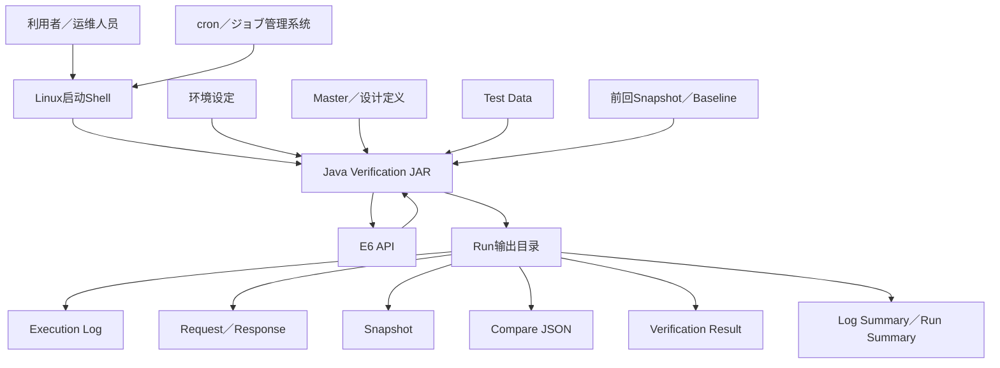
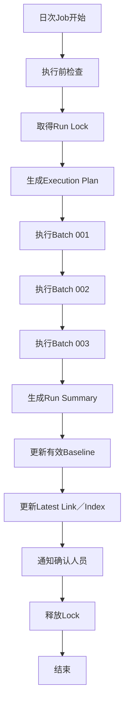

# API UseCase工具利用方法

- 来源: https://chatgpt.com/g/g-p-6a5f4d3570688191a63c36d8624e43cc/c/6a6863fe-bc20-83ee-9061-b1defa1ab1f5
- 导出时间: 2026-07-29T20:53:51+09:00
- 分片: 1/1
- 总消息数: 3
- 总轮数: 1

## 第 1 轮

### 你

api usecase检证工具 我想总结他的 利用方法 比如发布到ec2的linux系统里 然后一个batch里调用e6 api 每个调用都有snapshot 前回 今回 期待值的对比 各个api返回项目的一些业务check。以及api直接的返回项目的一些关连check  。java的jar启动 多个batch按顺序执行 。每个batch执行后会有log和那些比较json文件。然后做成log总结文件。 主要是想知道 tool的结构  初期设定 执行环境 执行方式 执行结果构成 结果文件详细 确认方式 等

### ChatGPT

我会把它整理成一份“利用方法总览”，重点不是继续扩展设计，而是让使用者一眼看懂：怎么部署、怎么设定、怎么执行、会产出什么、在哪里确认。

### ChatGPT

你现在需要总结的不是“内部类怎么实现”，而是站在**利用者、运维人员、确认人员**角度说明这个工具如何安装、设定、执行和确认。

下面可以作为今后的：

```text
API UseCase検証ツール 利用方法概要
```

也可以继续扩展成正式的：

```text
利用手順書
実行環境設計書
初期設定手順書
日次運用手順書
実行結果確認手順書
```

:::writing{variant="document" id="72841"}
# API UseCase検証ツール 利用方法概要

## 1. 工具定位

本工具是部署在EC2 Linux服务器上的Java Batch工具，用于按照预先定义的UseCase和Scenario，连续调用多个E6 API，并自动完成以下处理：

```text
E6 API顺序调用
        ↓
Request／Response保存
        ↓
字段级Snapshot生成
        ↓
前回／今回／期待值比较
        ↓
单API业务Check
        ↓
API间关联Check
        ↓
UseCase整体结果判定
        ↓
Log与比较JSON生成
        ↓
Batch执行结果汇总
```

工具本身不实现E6业务逻辑，也不替代业务系统。

它负责：

- 按设计好的顺序调用E6 API。
- 将前一个API的返回项目传递给下一个API。
- 验证各API的HTTP执行结果。
- 验证Request和Response的字段结构。
- 比较前回Snapshot与今回Snapshot。
- 根据期待定义执行业务规则检查。
- 验证不同API之间的项目关联。
- 保存完整执行证迹。
- 生成供确认者查看的总结文件。

---

# 2. 整体利用构成



---

# 3. EC2 Linux上的工具结构

建议EC2上的目录分成五类：

```text
/opt/e6-api-verifier/
├── app/
│   ├── e6-api-verifier.jar
│   └── lib/
│
├── bin/
│   ├── run-all.sh
│   ├── run-batch.sh
│   ├── retry-batch.sh
│   ├── validate-config.sh
│   └── cleanup.sh
│
├── config/
│   ├── application.yml
│   ├── environment/
│   │   ├── dev.yml
│   │   ├── stg.yml
│   │   └── prod-like.yml
│   ├── batch/
│   │   ├── batch-001.yml
│   │   ├── batch-002.yml
│   │   └── batch-sequence.yml
│   └── logging/
│       └── logback.xml
│
├── definitions/
│   ├── master/
│   ├── execution-spec/
│   ├── test-data/
│   ├── expected/
│   └── schemas/
│
├── runtime/
│   ├── control/
│   ├── lock/
│   ├── work/
│   └── tmp/
│
├── baseline/
│   ├── BATCH-001/
│   ├── BATCH-002/
│   └── index.json
│
├── outputs/
│   ├── runs/
│   ├── latest/
│   └── summaries/
│
└── logs/
    ├── application/
    └── operation/
```

## 3.1 各目录职责

|目录|职责|
|---|---|
|`app/`|保存Java JAR及依赖库|
|`bin/`|保存启动、重试、检查、清理Shell|
|`config/`|保存环境、Batch和日志设定|
|`definitions/`|保存API、UseCase、Scenario、验证规则和测试数据|
|`runtime/`|保存运行中的Lock、临时文件和控制状态|
|`baseline/`|保存各API上一次有效Snapshot|
|`outputs/`|保存每次执行结果|
|`logs/`|保存工具自身的应用日志和操作日志|

`runtime`、`baseline`、`outputs`必须与JAR程序本体分离，避免更新JAR时误删历史结果。

---

# 4. 执行单位

本工具建议采用以下层级：

```text
Daily Run
  ├── Batch 001
  │     ├── UseCase 001
  │     │     ├── Scenario 001
  │     │     ├── API Step 001
  │     │     └── API Step 002
  │     └── UseCase 002
  │
  ├── Batch 002
  │     └── UseCase 003
  │
  └── Batch 003
        └── UseCase 004
```

|单位|含义|
|---|---|
|Run|一次完整启动，例如日次执行|
|Batch|可独立启动和管理的一组UseCase|
|UseCase|一个业务目的对应的验证链|
|Scenario|UseCase中的正常、分支或异常路径|
|API Step|单个E6 API调用|

---

# 5. Batch顺序执行方式

## 5.1 推荐方式

不要由多个互不相关的Java进程自行判断顺序。

推荐由一个外层Shell或Job Scheduler统一控制：

```text
run-all.sh
    ↓
BATCH-001启动
    ↓
确认BATCH-001 Exit Code
    ↓
BATCH-002启动
    ↓
确认BATCH-002 Exit Code
    ↓
BATCH-003启动
    ↓
生成Daily Run Summary
```

示例：

```bash
java -jar app/e6-api-verifier.jar \
  run \
  --environment STG \
  --batch-id BATCH-001 \
  --run-id RUN-20260728-090000
```

完成后继续：

```bash
java -jar app/e6-api-verifier.jar \
  run \
  --environment STG \
  --batch-id BATCH-002 \
  --run-id RUN-20260728-090000
```

全部Batch共享同一个`runId`，但每个Batch拥有独立的`batchExecutionId`。

## 5.2 顺序控制定义

```yaml
runDefinition:
  id: DAILY-E6-VERIFICATION
  executionMode: SEQUENTIAL

  batches:
    - batchId: BATCH-001
      order: 10
      required: true
      onFailure: STOP

    - batchId: BATCH-002
      order: 20
      required: true
      onFailure: STOP

    - batchId: BATCH-003
      order: 30
      required: false
      onFailure: CONTINUE
```

## 5.3 前一Batch失败时

|设定|处理|
|---|---|
|`STOP`|停止后续Batch|
|`CONTINUE`|记录失败并继续|
|`SKIP_DEPENDENT`|只跳过依赖该Batch的后续Batch|
|`MANUAL_DECISION`|停止并等待人工处理|

---

# 6. 初期设定

初期设定分为六类。

## 6.1 执行环境设定

```yaml
environment:
  id: STG
  timezone: Asia/Tokyo
  endpointReference: E6-STG-ENDPOINT
  connectionTimeoutMs: 5000
  readTimeoutMs: 30000
  productionExecutionAllowed: false
```

实际Endpoint、Token、密码等机密信息不得直接写入Master或结果文件。

应通过以下方式取得：

- EC2环境变量。
- AWS Systems Manager Parameter Store。
- AWS Secrets Manager。
- 受限权限的外部配置文件。

---

## 6.2 API定义

每个API至少需要：

```text
API ID
API名称
HTTP Method
Path
Header
Path Parameter
Query Parameter
Request Body
Response字段
期待HTTP Status
Timeout
Retry
Mask规则
```

---

## 6.3 UseCase／Scenario定义

需要定义：

```text
API调用顺序
入口参数
前置条件
分支条件
Skip条件
停止条件
后续API
最终业务结果
```

UseCase中的API不只是简单列表，还需要明确Context Mapping。

---

## 6.4 Context Mapping设定

例如API-001返回的`customerId`要传给API-002：

|Mapping ID|From API|Response JSONPath|Context|To API|Request JSONPath|
|---|---|---|---|---|---|
|MAP-001|API-001|`$.customerId`|`CTX-CUSTOMER-ID`|API-002|`$.customerId`|

执行时：

```text
API-001 Response
        ↓
从$.customerId抽取值
        ↓
保存到CTX-CUSTOMER-ID
        ↓
生成API-002 Request
        ↓
设定到$.customerId
```

Context必须定义Producer、Consumer、Scope和Lifetime，不能只把字段值临时放入Java变量。已有设计中也明确区分了Entry Input生成、Response抽取以及Request Binding。fileciteturn1file18

---

## 6.5 验证规则设定

每个API返回项目可以设定：

```text
HTTP Status
Required
Nullability
Type
Length
Format
Enum
Fixed Value
Range
Pattern
Count
Aggregate
Reference
Expression
Relation
Baseline Compare
Ignore
Observation Only
```

工具原始目标就是同时验证API调用成功、Request／Response结构、字段类型和长度、返回值变化，以及后续API参数继承。fileciteturn1file2

---

## 6.6 初回执行设定

```json
{
  "initialExecutionFlg": true
}
```

初回执行时：

```text
Baseline不存在
        ↓
initialExecutionFlg=true
        ↓
允许调用API
        ↓
保存今回Snapshot
        ↓
不执行前回／今回比较
        ↓
正常执行期待值和业务Check
        ↓
今回Snapshot作为下一回Baseline
        ↓
initialExecutionFlg更新为false
```

第二次以后：

```text
优先读取Baseline
        ↓
Baseline不存在
        ↓
尝试取得前一次完整成功执行的Snapshot
        ↓
仍然不存在
        ↓
ERROR／BLOCKED
```

前回值应来源于前一次有效执行结果；初回没有前回值时，应明确作为Initial状态，而不是伪造PASS。fileciteturn1file12

---

# 7. 执行前确认

正式执行前，建议先运行：

```bash
./bin/validate-config.sh --environment STG
```

或者：

```bash
java -jar app/e6-api-verifier.jar validate \
  --environment STG \
  --batch-id BATCH-001
```

需要检查：

|检查项目|内容|
|---|---|
|Java|版本是否正确|
|JAR|版本是否正确|
|环境|Environment ID是否存在|
|Endpoint|是否可解析|
|认证|Secret引用是否可取得|
|网络|EC2是否能访问E6 API|
|Master|ID和Reference是否正确|
|UseCase|API调用顺序是否完整|
|Context|Producer和Consumer是否成立|
|Test Data|必填入口数据是否存在|
|Baseline|初回Flg与Baseline状态是否一致|
|输出目录|是否有写权限|
|Disk|剩余容量是否足够|
|Lock|同一Batch是否已经运行|

检查失败时不得开始调用E6 API。

---

# 8. 执行方式

## 8.1 全Batch日次执行

```bash
./bin/run-all.sh \
  --environment STG \
  --run-mode DAILY
```

## 8.2 指定Batch执行

```bash
./bin/run-batch.sh \
  --environment STG \
  --batch-id BATCH-002
```

## 8.3 指定UseCase执行

```bash
java -jar app/e6-api-verifier.jar run \
  --environment STG \
  --batch-id BATCH-002 \
  --usecase-id UC-003
```

## 8.4 指定Scenario执行

```bash
java -jar app/e6-api-verifier.jar run \
  --environment STG \
  --usecase-id UC-003 \
  --scenario-id SC-003-02
```

## 8.5 失败对象再执行

```bash
./bin/retry-batch.sh \
  --source-run-id RUN-20260728-090000 \
  --failed-only
```

再执行必须生成新的`runId`或`retryExecutionId`，不得覆盖原执行结果。

## 8.6 只生成执行计划

```bash
java -jar app/e6-api-verifier.jar plan \
  --environment STG \
  --batch-id BATCH-001
```

该模式不调用E6 API，只生成：

```text
计划执行哪些Batch
计划执行哪些UseCase
API调用顺序
使用哪些Test Data
使用哪个Baseline
适用哪些验证规则
```

---

# 9. 单个API的执行处理

每个API Step执行以下固定流程：

```text
1. API执行条件判定
2. Context Before Snapshot保存
3. Request参数绑定
4. Request发送前验证
5. Request Snapshot保存
6. 调用E6 API
7. 接收HTTP Response
8. Response Parse
9. Response Snapshot保存
10. HTTP Status验证
11. Response项目业务Check
12. 前回／今回比较
13. API间关系Check
14. Context抽取和更新
15. Context After Snapshot保存
16. API Step Result确定
```

---

# 10. 三类比较必须分开

## 10.1 前回与今回比较

目的：

> 检查E6 API的实际返回内容相对于前一次执行是否发生变化。

```text
Previous Snapshot
        +
Current Snapshot
        ↓
Compare Policy
        ↓
Diff Result
```

主要发现：

- 字段增加。
- 字段减少。
- 类型变化。
- 值变化。
- null与非null变化。
- 数组件数变化。
- 数组顺序变化。
- JSON层级变化。

## 10.2 今回与期待值比较

目的：

> 判断今回返回值是否满足业务和API契约。

```text
Current Response
        +
Expected Definition
        ↓
Verification Rule
        ↓
Verification Result
```

期待值不一定是固定值，也可以是：

- 类型。
- 长度。
- 枚举。
- 范围。
- 正则格式。
- 日期条件。
- 前一个API的值。
- 计算公式。
- 数组汇总。
- 业务关系。

## 10.3 前回与期待值不是一回事

例如：

```text
前回 status = ACTIVE
今回 status = SUSPENDED
期待值允许 ACTIVE／SUSPENDED
```

结果：

|检查|结果|
|---|---|
|前回／今回|DIFF|
|今回／期待值|PASS|

因此不能因为有Diff就直接判定业务失败。

相反：

```text
前回 status = ACTIVE
今回 status = ACTIVE
期待值只允许 CLOSED
```

结果：

|检查|结果|
|---|---|
|前回／今回|NO DIFF|
|今回／期待值|FAIL|

---

# 11. 单API业务Check

每个API的Response项目可以执行以下业务检查。

|检查类别|例|
|---|---|
|固定值|`systemCode = E6`|
|枚举|`status ∈ ACTIVE, INACTIVE`|
|范围|`amount >= 0`|
|日期|`processingDate = businessDate`|
|格式|ID必须为12位数字|
|件数|`items.size = totalCount`|
|汇总|明细金额合计等于totalAmount|
|唯一性|transactionId不得重复|
|条件项目|`exists=true`时customerStatus必须存在|
|业务结果|`exists=false`应判定为“客户不存在”，而不是系统异常|

Verification Master中已经将HTTP状态、Required、Type、Fixed Value、Enum、Relation、Schema、Execution Path和Baseline Compare等作为不同的验证类别管理。fileciteturn1file14

---

# 12. API间关联Check

API间关系检查是UseCase验证的核心之一。

## 12.1 Request／Response关联

例如：

```text
API-001.response.customerId
=
API-002.request.customerId
```

## 12.2 前后状态迁移

例如：

```text
API-001.response.status = PENDING
        ↓
API-002执行
        ↓
API-003.response.status = COMPLETED
```

## 12.3 金额关联

```text
API-001.response.balance
-
API-002.request.amount
=
API-003.response.balance
```

## 12.4 ID关联

```text
API-002.response.transactionId
=
API-003.request.transactionId
=
API-003.response.transactionId
```

## 12.5 件数或集合关联

```text
API-001返回的accountId集合
包含
API-002处理的accountId
```

关联Check结果应独立输出，不得只埋在普通Log中。

---

# 13. API Step结果

每个API Step需要分别保存：

```text
Execution Result
Verification Result
Compare Result
Relation Check Result
```

例如：

```json
{
  "stepId": "STEP-002",
  "apiId": "API-002",
  "execution": {
    "status": "COMPLETED",
    "httpStatus": 200
  },
  "verification": {
    "result": "PASS"
  },
  "comparison": {
    "result": "DIFF",
    "diffCount": 2
  },
  "relationCheck": {
    "result": "PASS"
  },
  "overallResult": "PASS"
}
```

有Diff但业务检查正常时，可以：

```text
Step Result = PASS
Diff Status = CHANGED
```

不能将所有变化都直接判成FAIL。

---

# 14. Run输出目录

每次Run生成独立目录：

```text
outputs/runs/
└── RUN-20260728-090000-8F31A2/
    ├── run-info.json
    ├── run-status.json
    ├── execution-plan.json
    │
    ├── batches/
    │   ├── BATCH-001/
    │   │   ├── batch-result.json
    │   │   ├── batch-summary.md
    │   │   └── usecases/
    │   │       └── UC-001/
    │   │           ├── usecase-result.json
    │   │           └── scenarios/
    │   │               └── SC-001/
    │   │                   ├── scenario-result.json
    │   │                   ├── api-steps/
    │   │                   ├── verification/
    │   │                   ├── relations/
    │   │                   └── context/
    │   └── BATCH-002/
    │
    ├── raw/
    ├── snapshots/
    ├── diff/
    ├── verification/
    ├── relations/
    ├── logs/
    ├── reports/
    └── evidence-index.json
```

---

# 15. 每个API的结果文件

例如：

```text
api-steps/
└── STEP-001_API-001/
    ├── step-result.json
    ├── execution.json
    ├── request/
    │   ├── request-metadata.json
    │   ├── request-header.masked.json
    │   └── request-body.masked.json
    ├── response/
    │   ├── response-metadata.json
    │   ├── response-header.masked.json
    │   └── response-body.masked.json
    ├── snapshot/
    │   ├── previous.snapshot.json
    │   ├── current.snapshot.json
    │   └── expected-definition.json
    ├── diff/
    │   ├── previous-current.diff.json
    │   └── diff-summary.json
    ├── verification/
    │   ├── field-check-result.json
    │   ├── business-check-result.json
    │   └── verification-summary.json
    ├── relations/
    │   └── relation-check-result.json
    └── logs/
        └── step.log
```

---

# 16. 主要结果JSON

## 16.1 `run-info.json`

记录：

```text
runId
执行环境
JAR版本
Config版本
Master版本
开始时间
结束时间
启动用户
启动方式
EC2 Host
执行模式
```

## 16.2 `execution-plan.json`

记录实际计划：

```text
Batch顺序
UseCase顺序
Scenario顺序
API调用顺序
Test Data
Baseline Reference
适用规则
停止策略
```

## 16.3 `request-metadata.json`

记录：

```text
API ID
Method
URL
调用时间
Header名称
Query名称
Body大小
Correlation ID
```

密码、Token、Authorization不得保存原值。

## 16.4 `response-metadata.json`

记录：

```text
HTTP Status
Content-Type
Response大小
开始时间
结束时间
响应时间
Retry次数
```

## 16.5 `current.snapshot.json`

保存今回Response的规范化结果，用于：

- 字段级验证。
- 前回比较。
- 下次Baseline。
- 问题调查。

## 16.6 `previous-current.diff.json`

建议结构：

```json
{
  "apiId": "API-001",
  "previousSnapshotId": "SNP-20260727-API001",
  "currentSnapshotId": "SNP-20260728-API001",
  "result": "DIFF",
  "diffCount": 2,
  "differences": [
    {
      "path": "$.customerStatus",
      "category": "VALUE_CHANGED",
      "previous": "ACTIVE",
      "current": "SUSPENDED",
      "severity": "MAJOR",
      "ignored": false
    }
  ]
}
```

## 16.7 `field-check-result.json`

记录每个项目的期待值检查：

```json
{
  "apiId": "API-001",
  "checks": [
    {
      "ruleId": "VER-API001-STATUS-TYPE",
      "path": "$.customerStatus",
      "checkType": "ENUM",
      "expected": ["ACTIVE", "INACTIVE", "SUSPENDED"],
      "actual": "SUSPENDED",
      "result": "PASS"
    }
  ]
}
```

## 16.8 `relation-check-result.json`

```json
{
  "useCaseId": "UC-001",
  "checks": [
    {
      "checkId": "REL-001",
      "leftReference": "API-001.response.$.customerId",
      "operator": "EQUALS",
      "rightReference": "API-002.request.$.customerId",
      "result": "PASS"
    }
  ]
}
```

## 16.9 `batch-result.json`

记录：

```text
Batch执行状态
UseCase总数
PASS数
FAIL数
ERROR数
BLOCKED数
SKIPPED数
Diff数
开始时间
结束时间
Exit Code
```

---

# 17. Log构成

Log建议分为三层。

## 17.1 Application Log

```text
logs/application/e6-api-verifier.log
```

记录Java工具内部情况：

- Bootstrap。
- Config Loader。
- Master Loader。
- HTTP Client。
- 文件I/O。
- Exception。
- JVM信息。

## 17.2 Run Execution Log

```text
outputs/runs/{runId}/logs/run.log
```

记录本次Run全过程：

```text
Run开始
Batch开始／结束
UseCase开始／结束
Scenario开始／结束
API调用开始／结束
验证开始／结束
Snapshot保存
Diff完成
报告生成
```

## 17.3 Step Log

```text
api-steps/{stepId}/logs/step.log
```

用于详细调查单个API。

所有Log必须带有：

```text
runId
batchExecutionId
useCaseId
scenarioId
stepId
apiId
correlationId
timestamp
level
reasonCode
```

---

# 18. Log总结文件

全部Batch结束后生成：

```text
outputs/runs/{runId}/reports/
├── Daily_Run_Summary.md
├── Batch_Result_Summary.md
├── API_Result_Summary.md
├── Diff_Summary.md
├── Verification_Failure_Summary.md
├── Relation_Check_Summary.md
└── Error_Summary.md
```

## 18.1 Daily Run Summary

|项目|内容|
|---|---|
|Run ID|本次执行ID|
|环境|STG|
|执行时间|开始／结束|
|Batch数|计划／执行／跳过|
|UseCase数|PASS／FAIL／ERROR|
|API调用数|成功／失败|
|Diff数|Critical／Major／Minor|
|业务Check失败数|件数|
|关联Check失败数|件数|
|最终结果|PASS／FAIL／ERROR／BLOCKED|

## 18.2 API Result Summary

|Batch|UseCase|Scenario|Step|API|HTTP|Execution|Verification|Diff|Relation|Overall|
|---|---|---|---|---|---:|---|---|---|---|---|

## 18.3 Diff Summary

|API|JSONPath|差异种类|前回|今回|Ignore|Severity|结果|
|---|---|---|---|---|---|---|---|

## 18.4 Failure Summary

只列出需要确认的内容：

```text
HTTP Status不符合期待
必须字段不存在
类型错误
固定值错误
业务Check失败
API关联失败
Baseline丢失
Context抽取失败
E6调用超时
工具内部异常
```

---

# 19. 执行结果确认顺序

确认人员不应该直接从大量JSON开始看。

推荐固定为五级确认。

## Level 1：Daily Run Summary

先确认：

```text
本次整体是PASS、FAIL、ERROR还是BLOCKED
哪个Batch失败
哪个UseCase失败
是否有新Diff
```

## Level 2：Batch／UseCase Summary

确认失败范围：

```text
哪个UseCase
哪个Scenario
哪个API Step
```

## Level 3：Failure／Diff Summary

确认问题类型：

```text
API调用失败
业务期待值失败
前回差异
API间关系失败
工具异常
```

## Level 4：详细JSON

查看：

```text
previous-current.diff.json
field-check-result.json
business-check-result.json
relation-check-result.json
step-result.json
```

## Level 5：Raw Evidence与Log

只有需要调查时才确认：

```text
Mask后的Request
Mask后的Response
Step Log
Application Log
Context Snapshot
```

---

# 20. 结果判定

统一使用：

```text
PASS
FAIL
ERROR
BLOCKED
SKIPPED
```

|结果|含义|
|---|---|
|PASS|执行成功，所有必须验证通过|
|FAIL|工具正常执行，但E6返回或业务结果不符合期待|
|ERROR|工具、网络、解析或规则执行发生技术异常|
|BLOCKED|缺少认证、Baseline、Test Data或必要前提，无法执行|
|SKIPPED|因分支、依赖或设定未执行|

Diff状态应另外管理：

```text
NO_DIFF
DIFF
INITIAL
NOT_COMPARED
```

不能增加`PASS_WITH_DIFF`之类混合结果。

Verification Policy已将运行时结果统一为PASS、FAIL、ERROR、BLOCKED和SKIPPED，并要求执行路径、依赖、证迹等按明确顺序进行评估。fileciteturn1file17

---

# 21. Exit Code建议

|Exit Code|含义|
|---:|---|
|0|全部PASS|
|1|存在业务或契约FAIL|
|2|存在工具执行ERROR|
|3|执行被BLOCKED|
|4|部分对象SKIPPED，但无FAIL／ERROR|
|10|启动参数错误|
|11|Config错误|
|12|Master／Spec错误|
|13|Baseline错误|
|14|认证或权限错误|
|20|输出文件生成失败|
|99|未分类系统异常|

Shell根据Exit Code决定是否继续下一个Batch。

---

# 22. Baseline更新规则

默认只允许以下结果成为下一次Baseline：

```text
API Execution = COMPLETED
Response Parse = SUCCESS
Snapshot Generation = SUCCESS
```

是否要求业务Check也必须PASS，需要按项目方针冻结。

推荐：

```text
技术上取得完整Response
        ↓
保存Current Snapshot
        ↓
若Step不是ERROR／BLOCKED
        ↓
作为下一次Previous Snapshot候选
```

但是以下结果不得覆盖现有Baseline：

- API超时。
- 网络连接失败。
- Response无法Parse。
- Snapshot生成失败。
- 输出文件不完整。
- 运行被强制中断。
- 取得了非预期的中间错误页。
- 敏感信息处理失败。

---

# 23. 日次运用流程



---

# 24. 确认人员每天需要做什么

日常确认原则上只需要：

1. 打开`Daily_Run_Summary.md`。
2. 确认整体结果。
3. 确认是否出现新Diff。
4. 确认FAIL／ERROR／BLOCKED件数。
5. 进入对应的Failure Summary。
6. 需要时查看详细Diff JSON或Step Log。
7. 记录确认结果和处理状态。

不需要每天逐个打开所有Request和Response文件。

---

# 25. 初期导入流程

第一次在EC2部署时：

```text
1. 准备EC2 Linux
2. 安装指定JDK
3. 创建专用OS用户
4. 创建工具目录
5. 配置目录权限
6. 部署JAR
7. 部署Shell
8. 部署环境Config
9. 设置Secrets引用
10. 部署Master／Execution Spec／Test Data
11. 设置initialExecutionFlg=true
12. 执行Config Validation
13. 执行Dry Run
14. 执行单一API连接确认
15. 执行单一UseCase
16. 确认Snapshot和报告
17. 执行全部Batch
18. 设置cron或Job Scheduler
19. 设置Log Rotation
20. 设置Output Retention
```

---

# 26. 最终利用者视角

## 工具管理员负责

```text
JAR部署
环境配置
Secret设置
Scheduler设置
权限管理
Log Rotation
历史结果清理
```

## 设计担当负责

```text
API定义
UseCase定义
Scenario定义
Context Mapping
Verification Rule
Compare Policy
Test Data
```

## 日次运维人员负责

```text
Job启动确认
Summary确认
FAIL／ERROR／BLOCKED确认
异常升级
必要时再执行
```

## 业务确认人员负责

```text
业务Check结果确认
API间关联结果确认
差异内容判断
业务规格变化确认
```

## 工具开发人员负责

```text
Java Runtime
HTTP执行
Snapshot
Diff Engine
Verification Engine
Report Generator
异常修正
```

---

# 27. 最终总结

工具利用过程可以概括为：

```text
初期准备
    EC2／JDK／JAR／Config／Master／Test Data／Secret

        ↓

执行
    Shell或Scheduler按顺序启动多个Java Batch

        ↓

API调用
    每个Batch按照UseCase和Scenario顺序调用E6 API

        ↓

证迹
    保存Request、Response、Context、Snapshot和Log

        ↓

判定
    执行HTTP、字段、业务、前回差异和API间关系检查

        ↓

汇总
    生成Batch Summary、Diff Summary、Failure Summary和Daily Summary

        ↓

确认
    确认者先看总结，再逐层进入详细JSON和Log
```

工具的核心不是“调用了几个API”，而是确保：

```text
为什么调用
按什么顺序调用
使用了什么输入
得到了什么结果
与前回有什么变化
是否满足期待值
不同API之间是否保持业务关联
发生问题时能否通过文件追踪
```
:::

这份内容已经把你提出的**工具结构、初期设定、EC2执行环境、Java JAR启动、多个Batch顺序执行、Snapshot比较、业务Check、API关联Check、日志、结果JSON、汇总文件以及确认方式**串成了一套完整的利用流程。

从成果物分类看，后续不应该把这些全部塞进一份设计书。建议拆成以下五份正式文档：

```text
01_API UseCase検証ツール利用概要.md
02_EC2実行環境・配置設計書.md
03_初期設定・導入手順書.md
04_Batch実行・日次運用手順書.md
05_実行結果・障害確認手順書.md
```
