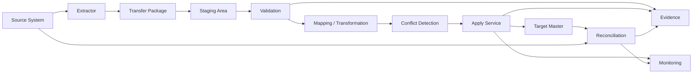
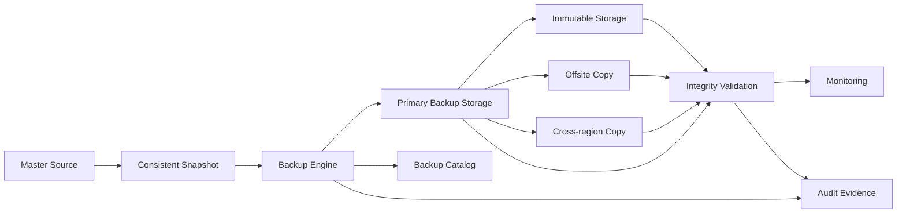
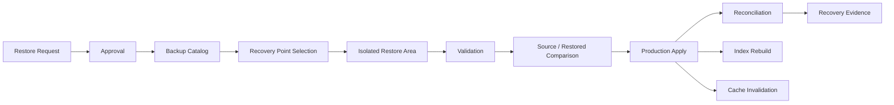
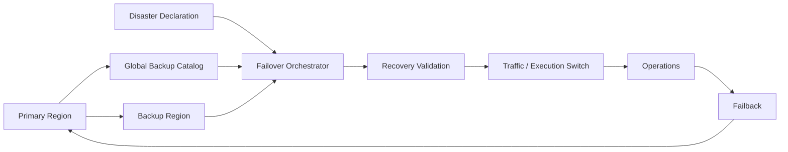

# API流程验证设计

- 来源: https://chatgpt.com/c/6a30db25-a6bc-83e8-ba19-4bc5fc0a5e28
- 导出时间: 2026-07-21T18:12:57+09:00
- 分片: 6/6
- 总消息数: 551
- 总轮数: 254

## 第 251 轮

### 你

继续

### ChatGPT

继续完成 `Master_Import・Export・Synchronization設計書.md`，统一导入导出、全量／增量同步、映射转换、冲突解决、断点续传、对账与审计。

### ChatGPT

```text
system/02_master/design/
Master_Import・Export・Synchronization設計書.md
```

:::writing{variant="document" id="48317"}
# Master_Import・Export・Synchronization設計書

## 1. 文書情報

| 項目 | 内容 |
|---|---|
| 文書名 | Master_Import・Export・Synchronization設計書 |
| 文書ID | E6-API-VP-MASTER-IMPORT-EXPORT-SYNC-DESIGN |
| 対象システム | E6 API Verification Platform |
| 対象領域 | Master Import / Export / Synchronization / Reconciliation |
| 対象ディレクトリ | `system/02_master/` |
| 文書種別 | 詳細設計書 |
| ステータス | DRAFT |
| バージョン | 0.1.0 |
| 作成日 | 2026-07-21 |
| 作成責任 | Verification Platform Team |
| レビュー責任 | System Architect / Data Lead / Runtime Lead / Security Lead / QA Lead / Operations Lead |
| 承認責任 | Verification Platform Owner / System Owner |

---

## 2. 改訂履歴

| バージョン | 日付 | 変更内容 | 作成者 | 承認者 |
|---|---|---|---|---|
| 0.1.0 | 2026-07-21 | 初版作成 | Verification Platform Team | 未承認 |

---

## 3. 目的

本書は、E6 API Verification PlatformにおけるMaster Data、Design Data、Verification Asset、Snapshot、Result Metadata等のImport、ExportおよびSynchronization共通仕様を定義する。

本設計により以下を実現する。

- 異なるEnvironment間でMasterを安全に移送する
- 外部RepositoryからMasterを取込む
- Platform内のMasterを標準形式で出力する
- 全量および増分同期を統一する
- SourceとTargetの差分を検出する
- Import前にSchema、Policy、Referenceを検証する
- MappingとTransformationをVersion管理する
- Duplicate Dataの生成を防止する
- 同一要求の再実行を安全にする
- 中断したTransferをCheckpointから再開する
- Conflictを自動または手動で解決する
- SourceとTargetの整合性を照合する
- ManifestとChecksumでTransfer完全性を証明する
- Sensitive DataのExportを制御する
- Export Packageを暗号化する
- Import／Export操作を監査可能にする
- 大量DataをBatch、Chunk、Streaming方式で処理する
- Partial Failureを隔離する
- Failed Recordを再処理する
- Synchronization Lagを監視する
- Import／Export Evidenceを保存する
- Rollback可能なImportを実現する
- Production Masterの無承認変更を防止する

---

## 4. 基本原則

### 4.1 Source Authority

同期対象ごとにAuthorityとなるSourceを明示する。

### 4.2 Explicit Direction

Import、Export、Push、Pull、Bidirectionalの方向を明示する。

### 4.3 Validate Before Apply

Import Dataは適用前に必ず検証する。

### 4.4 Idempotent Processing

同一Packageまたは同一Eventの再処理で重複結果を生成しない。

### 4.5 Immutable Evidence

処理時のManifest、Checksum、Validation Result、Mapping Versionを保存する。

### 4.6 Atomic Where Required

関連Master群は必要に応じて一括適用する。

### 4.7 Partial Failure Isolation

一件の異常で全体を無条件に停止させない。

### 4.8 No Silent Conflict

競合を暗黙的に上書きしない。

### 4.9 Schema Version Awareness

Source SchemaとTarget SchemaのVersion差を明示的に扱う。

### 4.10 Security by Classification

Data Classificationに基づきExport可否、暗号化、Maskingを決定する。

### 4.11 Bounded Synchronization Lag

Synchronization Lagの許容上限を定義する。

### 4.12 Reconciliation Required

転送完了だけでなくSource／Targetの一致を確認する。

---

## 5. 適用範囲

本書の対象：

- Import Definition
- Export Definition
- Synchronization Definition
- Source System
- Target System
- Direction
- Trigger
- Full Import
- Incremental Import
- Full Export
- Delta Export
- Push
- Pull
- Bidirectional Synchronization
- Mapping
- Transformation
- Validation
- Merge
- Conflict Detection
- Conflict Resolution
- Duplicate Prevention
- Idempotency
- Checkpoint
- Watermark
- Resume
- Retry
- File Format
- Package
- Manifest
- Checksum
- Compression
- Encryption
- Transfer
- Staging
- Apply
- Rollback
- Reconciliation
- Audit
- Metrics
- Dashboard
- Alert
- API
- CLI
- Java Interface
- Repository
- Test
- Review Checklist
- Completion Criteria

---

## 6. 管理対象外

本書では以下を直接管理しない。

- 一般ETL Platform全体
- Business System本体のData Migration
- Database Replication Engine内部
- Network File Transfer Product内部
- Source Control System内部
- Object Storage製品内部
- External SaaS固有Implementation

ただしVerification PlatformとのInterfaceは対象とする。

---

## 7. 関連成果物

| 成果物 | 関係 |
|---|---|
| `Master_Data_Quality・Integrity・Consistency設計書.md` | Import Data品質 |
| `Master_Cache・Index・Search・Lookup設計書.md` | Import後Cache／Index更新 |
| `Master_Compatibility・Evolution・Deprecation設計書.md` | Schema互換性 |
| `Master_Configuration・Feature_Flag・Override設計書.md` | Transfer設定 |
| `Master_Security設計書.md` | Encryption／Masking |
| `Master_Operations・Monitoring・Audit設計書.md` | Audit／Monitoring |
| `Master_Governance・Ownership・Lifecycle設計書.md` | Authority／Ownership |
| `Master_Version・Hash・Snapshot設計書.md` | Version／Checksum |
| `Master_Scheduling・Calendar・Execution_Window設計書.md` | 定期同期 |
| `Master_Notification・Escalation・Communication設計書.md` | Failure通知 |

---

## 8. Import／Export Architecture



---

## 9. Synchronization Flow

```text
SYNC_REQUESTED
SOURCE_LOCKED_OR_SNAPSHOTTED
DATA_EXTRACTED
PACKAGE_CREATED
PACKAGE_TRANSFERRED
PACKAGE_VERIFIED
DATA_STAGED
SCHEMA_VALIDATED
REFERENCE_VALIDATED
DATA_TRANSFORMED
CONFLICT_DETECTED
CONFLICT_RESOLVED
CHANGESET_CREATED
CHANGESET_APPROVED
CHANGESET_APPLIED
CACHE_INVALIDATED
INDEX_UPDATED
RECONCILIATION_EXECUTED
EVIDENCE_ARCHIVED
SYNC_COMPLETED
```

---

## 10. Import Definition

Import処理の静的定義。

必須項目：

```text
importDefinitionId
name
sourceType
targetType
sourceSchemaVersion
targetSchemaVersion
mode
mappingDefinitionId
validationPolicyId
conflictPolicyId
transactionPolicy
rollbackPolicy
ownerId
lifecycle
version
```

---

## 11. Export Definition

Export処理の静的定義。

必須項目：

```text
exportDefinitionId
name
sourceType
targetFormat
selectionPolicy
maskingPolicy
compressionPolicy
encryptionPolicy
manifestPolicy
retentionPolicy
ownerId
lifecycle
version
```

---

## 12. Synchronization Definition

SourceとTarget間の同期規則。

必須項目：

```text
synchronizationDefinitionId
sourceSystemId
targetSystemId
direction
synchronizationMode
triggerType
checkpointPolicy
watermarkPolicy
mappingDefinitionId
conflictPolicyId
reconciliationPolicyId
sla
ownerId
version
```

---

## 13. Source System

Data提供元。

---

## 14. Target System

Data適用先。

---

## 15. Source Type

```text
MASTER_REPOSITORY
DATABASE
OBJECT_STORAGE
FILE_SYSTEM
REST_API
MESSAGE_QUEUE
EVENT_STREAM
SEARCH_INDEX
SNAPSHOT
MANUAL_UPLOAD
```

---

## 16. Target Type

```text
MASTER_REPOSITORY
DATABASE
OBJECT_STORAGE
FILE_SYSTEM
REST_API
MESSAGE_QUEUE
SEARCH_INDEX
ARCHIVE
EXTERNAL_TOOL
```

---

## 17. Synchronization Direction

```text
IMPORT
EXPORT
PUSH
PULL
BIDIRECTIONAL
MIRROR
```

---

## 18. Import

外部または他EnvironmentからPlatformへDataを取込む。

---

## 19. Export

Platformから外部または他EnvironmentへDataを出力する。

---

## 20. Push

Source側がTargetへ変更を送信する。

---

## 21. Pull

Target側がSourceから変更を取得する。

---

## 22. Bidirectional

SourceとTarget双方の変更を同期する。

---

## 23. Mirror

SourceをAuthorityとしてTargetを同一状態に維持する。

---

## 24. Synchronization Mode

```text
FULL
INCREMENTAL
DELTA
EVENT_DRIVEN
SNAPSHOT_BASED
MANUAL
```

---

## 25. Full Import

対象Dataを全件取込む。

---

## 26. Incremental Import

前回Checkpoint以降に変更されたDataのみ取込む。

---

## 27. Full Export

対象Dataを全件出力する。

---

## 28. Delta Export

前回Export以降の変更のみ出力する。

---

## 29. Event-driven Synchronization

Create、Update、Delete等のEventを契機に同期する。

---

## 30. Snapshot-based Synchronization

固定SnapshotをSourceとして同期する。

---

## 31. Manual Synchronization

権限を持つOperatorが手動実行する。

---

## 32. Trigger Type

```text
SCHEDULE
EVENT
MANUAL
API
DEPLOYMENT
APPROVAL
RECOVERY
```

---

## 33. Schedule Trigger

定期Scheduleで実行する。

---

## 34. Event Trigger

Source変更Eventで実行する。

---

## 35. Deployment Trigger

Release前後に必要なMasterを同期する。

---

## 36. Approval Trigger

Approval完了後に実行する。

---

## 37. Recovery Trigger

障害復旧または再同期時に実行する。

---

## 38. Transfer Unit

```text
RECORD
BATCH
FILE
PACKAGE
SNAPSHOT
EVENT
```

---

## 39. Record Unit

一件単位の処理。

---

## 40. Batch Unit

複数Recordを一括処理する。

---

## 41. File Unit

一つのFileを単位とする。

---

## 42. Package Unit

複数FileとManifestを一つのPackageとして扱う。

---

## 43. Snapshot Unit

整合性のある固定時点Dataを単位とする。

---

## 44. Import Lifecycle

```text
DRAFT
REQUESTED
UPLOADED
RECEIVED
VERIFYING
STAGED
VALIDATING
TRANSFORMING
WAITING_APPROVAL
APPLYING
RECONCILING
COMPLETED
PARTIALLY_COMPLETED
FAILED
ROLLED_BACK
CANCELLED
ARCHIVED
```

---

## 45. Export Lifecycle

```text
DRAFT
REQUESTED
EXTRACTING
PACKAGING
VALIDATING
ENCRYPTING
READY
TRANSFERRING
DELIVERED
ACKNOWLEDGED
FAILED
CANCELLED
EXPIRED
ARCHIVED
```

---

## 46. Synchronization Lifecycle

```text
IDLE
PLANNED
RUNNING
PAUSED
RETRYING
WAITING_DEPENDENCY
WAITING_APPROVAL
DEGRADED
COMPLETED
FAILED
CANCELLED
```

---

## 47. Import Request

必須項目：

- importRequestId
- importDefinitionId
- packageId
- targetEnvironmentId
- requestedBy
- requestedAt
- reason
- approvalRequired
- dryRun
- correlationId

---

## 48. Export Request

必須項目：

- exportRequestId
- exportDefinitionId
- sourceEnvironmentId
- selection
- requestedBy
- requestedAt
- purpose
- recipient
- expirationAt
- correlationId

---

## 49. Synchronization Run

実行単位。

必須項目：

- syncRunId
- synchronizationDefinitionId
- sourceSnapshotId
- checkpointBefore
- checkpointAfter
- startedAt
- completedAt
- status
- statistics
- evidenceId

---

## 50. Dry Run

実際のTarget更新を行わず、Validation、Transformation、Conflict Detection、Change Set生成まで実行する。

---

## 51. Dry Run結果

- Create予定件数
- Update予定件数
- Delete予定件数
- Skip予定件数
- Conflict件数
- Validation Error件数
- Warning件数
- Impacted Reference
- Expected Cache Invalidation
- Expected Index Update

---

## 52. Staging Area

Import Dataを本番Masterへ適用する前に一時保持する領域。

---

## 53. Staging原則

- Target Dataと分離
- Run単位で分離
- Access制御
- Retention設定
- Encryption
- Checksum保持
- Cleanup可能

---

## 54. Staging Status

```text
RECEIVED
VERIFIED
PARSED
VALIDATED
TRANSFORMED
READY
REJECTED
APPLIED
EXPIRED
PURGED
```

---

## 55. Source Snapshot

同期開始時点のSource状態を固定する。

---

## 56. Snapshot Requirement

全量Import、Production Import、ReconciliationではSource Snapshotを推奨する。

---

## 57. Extraction

SourceからTransfer対象Dataを読出す処理。

---

## 58. Extraction Filter

- Entity Type
- Environment
- Domain
- Status
- Version
- Updated At
- Owner
- Tag
- Approval State

---

## 59. Extraction Consistency

全件出力中にSourceが変更されても矛盾しない方式を採用する。

---

## 60. Selection Policy

Export対象を決定するPolicy。

---

## 61. Include Rule

明示的に出力対象へ含める条件。

---

## 62. Exclude Rule

機密情報、削除済Data、Environment固有Data等を除外する条件。

---

## 63. Export Data Classification

Export前にData Classificationを確認する。

---

## 64. Export Approval

CONFIDENTIAL以上またはProduction Dataは承認必須とする。

---

## 65. File Format

```text
JSON
JSONL
CSV
YAML
XML
PARQUET_OPTIONAL
ZIP_PACKAGE
TAR_PACKAGE
```

---

## 66. JSON

構造化Masterの標準形式候補。

---

## 67. JSONL

大量RecordのStreaming処理向け。

---

## 68. CSV

平坦なData交換向け。

Nested構造には原則使用しない。

---

## 69. YAML

人間によるReviewを重視する小規模定義向け。

---

## 70. XML

Legacy連携または契約上必要な場合に利用する。

---

## 71. Package

複数Data File、Manifest、Schema、Checksum、Signature等をまとめる。

---

## 72. Package Structure

```text
package/
├── manifest.json
├── schemas/
├── data/
├── checksums/
├── signatures/
├── reports/
└── README.md
```

---

## 73. Package ID

推奨：

```text
PKG-{TYPE}-{YYYYMMDDHHMMSS}-{UUID}
```

---

## 74. Package Version

Package Format自体のVersionを持つ。

---

## 75. Package Status

```text
CREATED
SEALED
TRANSFERRED
RECEIVED
VERIFIED
CONSUMED
REJECTED
EXPIRED
ARCHIVED
```

---

## 76. Manifest

Package内容と処理条件を記録する。

---

## 77. Manifest必須項目

```text
packageId
packageVersion
sourceSystemId
sourceEnvironmentId
targetSystemId
targetEnvironmentId
createdAt
createdBy
dataClassification
schemaVersions
mappingVersion
files
recordCounts
checksums
compression
encryption
signature
expirationAt
```

---

## 78. Manifest File Entry

- path
- mediaType
- size
- recordCount
- checksumAlgorithm
- checksum
- schemaId
- entityType

---

## 79. Manifest Validation

Manifest Schema、必須項目、File存在、Checksum一致、期限を確認する。

---

## 80. Checksum

転送中の破損または改ざんを検知する。

---

## 81. Checksum Algorithm

```text
SHA-256
SHA-384
SHA-512
```

---

## 82. Checksum Scope

- File
- Record Batch
- Whole Package
- Manifest
- Change Set

---

## 83. Digital Signature

重要Packageでは送信者真正性と改ざん防止に利用する。

---

## 84. Signature Verification

信頼済CertificateまたはKeyで検証する。

---

## 85. Compression

```text
NONE
GZIP
ZIP
ZSTD_OPTIONAL
```

---

## 86. Compression Bomb対策

展開後Size、File数、Depth、Compression Ratioを制限する。

---

## 87. Encryption

Export PackageまたはTransfer Channelを暗号化する。

---

## 88. Encryption Scope

- Transport
- Package
- Individual File
- Sensitive Field

---

## 89. Key Management

Encryption KeyをPackage内へ保存しない。

---

## 90. Expiration

Export Packageに有効期限を設定する。

---

## 91. Expired Package

期限切れPackageはImportまたはDownloadを拒否する。

---

## 92. Transfer Method

```text
HTTPS
SFTP
OBJECT_STORAGE
MESSAGE_QUEUE
EVENT_STREAM
SHARED_STORAGE
MANUAL_UPLOAD
```

---

## 93. Transfer Session

大容量Package転送の実行単位。

---

## 94. Chunk Transfer

大容量FileをChunk分割して転送する。

---

## 95. Chunk Metadata

- chunkNumber
- offset
- size
- checksum
- totalChunks
- uploadSessionId

---

## 96. Resume Transfer

中断したTransferを未完了Chunkから再開する。

---

## 97. Transfer Acknowledgement

Target受信完了後にACKを返す。

---

## 98. Delivery Guarantee

```text
AT_MOST_ONCE
AT_LEAST_ONCE
EFFECTIVELY_ONCE
```

---

## 99. Effectively Once

At-least-once DeliveryとIdempotencyにより実現する。

---

## 100. Idempotency Key

Import RequestまたはPackage単位で一意のKeyを持つ。

---

## 101. Idempotency Key構成

```text
sourceSystemId
packageId
targetEnvironmentId
importDefinitionVersion
```

---

## 102. Duplicate Package

同一Package IDとChecksumの再受信は既存結果を返す。

---

## 103. Package ID Collision

同一Package IDでChecksumが異なる場合はCritical Errorとする。

---

## 104. Record Identity

Entityを一意に識別するBusiness KeyまたはTechnical Key。

---

## 105. Natural Key

Business上の一意Key。

---

## 106. Surrogate Key

Platform内部で生成するTechnical ID。

---

## 107. Duplicate Detection

- Exact Key
- Composite Key
- Source ID
- Hash
- Business Rule
- Similarity候補

---

## 108. Duplicate Policy

```text
REJECT
SKIP
UPDATE_EXISTING
MERGE
CREATE_NEW_VERSION
MANUAL_REVIEW
```

---

## 109. Schema Validation

Import DataがSourceまたはTarget Schemaに適合するか確認する。

---

## 110. Schema Validation Phase

```text
PACKAGE
FILE
RECORD
FIELD
RELATIONSHIP
CHANGESET
```

---

## 111. Structural Validation

Field存在、型、配列、Object構造を確認する。

---

## 112. Semantic Validation

Status、Code、Date Range、Business Rule等を確認する。

---

## 113. Reference Validation

参照先Masterの存在とVersion整合性を確認する。

---

## 114. Cross-record Validation

同一Package内の重複や関係性を確認する。

---

## 115. Cross-environment Validation

異なるEnvironment固有値の混入を確認する。

---

## 116. Validation Severity

```text
INFO
WARNING
ERROR
FATAL
```

---

## 117. Validation Policy

ERRORまたはFATAL発生時の処理継続可否を定義する。

---

## 118. Fail Fast

最初の重大Errorで処理を停止する。

---

## 119. Collect All Errors

全Recordを検証し、Error一覧を作成する。

---

## 120. Quarantine

異常Recordのみ隔離する。

---

## 121. Mapping Definition

Source FieldとTarget Fieldの対応を定義する。

---

## 122. Mapping必須項目

```text
mappingDefinitionId
sourceSchemaVersion
targetSchemaVersion
fieldMappings
defaultRules
conversionRules
lookupRules
ownerId
version
```

---

## 123. Field Mapping

```text
sourcePath
targetPath
required
conversion
defaultValue
lookup
masking
onError
```

---

## 124. Direct Mapping

Source値をそのままTargetへ設定する。

---

## 125. Rename Mapping

Field名を変換する。

---

## 126. Composite Mapping

複数Source Fieldから一つのTarget Fieldを生成する。

---

## 127. Split Mapping

一つのSource Fieldを複数Target Fieldへ分割する。

---

## 128. Lookup Mapping

RegistryまたはMaster LookupによりTarget値を決定する。

---

## 129. Constant Mapping

固定値を設定する。

---

## 130. Default Mapping

Source値がない場合にDefaultを設定する。

---

## 131. Conditional Mapping

条件によりMapping Ruleを切替える。

---

## 132. Mapping Version

実行時に使用したMapping VersionをEvidenceへ記録する。

---

## 133. Transformation

値、構造、型、形式を変換する。

---

## 134. Transformation Type

```text
TYPE_CONVERSION
FORMAT_CONVERSION
NORMALIZATION
ENRICHMENT
MASKING
REDACTION
AGGREGATION
SPLIT
MERGE
LOOKUP
CALCULATION
```

---

## 135. Type Conversion

String、Number、Boolean、Date等を変換する。

---

## 136. Date Conversion

Timezone、Format、Precisionを明示する。

---

## 137. Normalization

Case、Whitespace、Unicode、Code表現を統一する。

---

## 138. Enrichment

Owner、Domain、Tag等をRegistryから補完する。

---

## 139. Masking

Sensitive Fieldの一部を不可視化する。

---

## 140. Redaction

Sensitive Fieldを完全に除去する。

---

## 141. Transformation Determinism

同一入力、同一Rule Versionでは同一結果を生成する。

---

## 142. Transformation Sandbox

Script Transformationを許可する場合は実行時間、Memory、Library、Network Accessを制限する。

---

## 143. Change Set

Targetへ適用する変更単位。

---

## 144. Change Type

```text
CREATE
UPDATE
DELETE
RETIRE
RESTORE
NO_CHANGE
```

---

## 145. Change Set必須項目

- changeSetId
- sourcePackageId
- targetEnvironmentId
- changes
- mappingVersion
- validationResultId
- conflictResultId
- impactSummary
- createdAt

---

## 146. Change Set Hash

適用前後でChange Set改ざんを検知する。

---

## 147. Change Set Approval

ProductionまたはHigh Impact変更では承認を要求する。

---

## 148. Impact Analysis

- 対象Entity数
- Dependent Scenario
- Dependent UseCase
- Policy影響
- Cache影響
- Index影響
- Active Run影響
- Environment影響

---

## 149. Merge

SourceとTargetのFieldをRuleに基づき統合する。

---

## 150. Merge Strategy

```text
SOURCE_WINS
TARGET_WINS
LATEST_WINS
FIELD_LEVEL
MANUAL
REJECT
```

---

## 151. Source Wins

Source値でTargetを上書きする。

---

## 152. Target Wins

Target値を維持する。

---

## 153. Latest Wins

更新時刻が新しい側を採用する。

Clock Drift Riskを考慮する。

---

## 154. Field-level Merge

FieldごとにAuthorityを定義する。

---

## 155. Manual Merge

Reviewerが採用値を選択する。

---

## 156. Conflict

SourceとTarget双方に互換性のない変更が存在する状態。

---

## 157. Conflict Type

```text
CREATE_CREATE
UPDATE_UPDATE
UPDATE_DELETE
DELETE_UPDATE
VERSION_CONFLICT
REFERENCE_CONFLICT
OWNERSHIP_CONFLICT
SCHEMA_CONFLICT
SECURITY_CONFLICT
```

---

## 158. Conflict Detection

Base Version、Source Version、Target Versionを比較する。

---

## 159. Three-way Comparison

Base、Source、Targetの三者比較により競合を判定する。

---

## 160. Conflict Resolution Policy

```text
AUTO_SOURCE
AUTO_TARGET
AUTO_LATEST
FIELD_RULE
MANUAL_REVIEW
REJECT_PACKAGE
QUARANTINE_RECORD
```

---

## 161. Security Conflict

Security Classificationが低下する変更は自動Mergeしない。

---

## 162. Ownership Conflict

Owner変更はOwner RegistryとApprovalを確認する。

---

## 163. Conflict Record

必須項目：

- conflictId
- entityId
- fieldPath
- baseValueHash
- sourceValueHash
- targetValueHash
- conflictType
- resolution
- resolvedBy
- resolvedAt
- evidenceId

---

## 164. Delete Handling

Source DeleteをTargetへ反映する方法を定義する。

---

## 165. Hard Delete

物理削除。

Master Dataでは原則制限する。

---

## 166. Soft Delete

Deleted Statusを設定する。

---

## 167. Retire

LifecycleをRETIREDへ変更する。

---

## 168. Tombstone

削除情報を同期するためのMarker。

---

## 169. Delete Protection

参照中EntityまたはActive Runで利用中のEntityは削除を拒否または遅延する。

---

## 170. Checkpoint

前回処理済位置を記録する。

---

## 171. Checkpoint Type

```text
OFFSET
SEQUENCE
TIMESTAMP
VERSION
EVENT_ID
FILE_POSITION
CURSOR
SNAPSHOT_ID
```

---

## 172. Checkpoint必須項目

- synchronizationDefinitionId
- sourcePartition
- checkpointType
- checkpointValue
- sourceVersion
- committedAt
- syncRunId

---

## 173. Checkpoint Commit

Target適用と必要に応じて同一Transactionまたは整合性保証された順序でCommitする。

---

## 174. Watermark

同期済み変更範囲の上限を示す。

---

## 175. High Watermark

今回同期対象の最大位置。

---

## 176. Low Watermark

安全に処理済みと確認された位置。

---

## 177. Late Arrival

Watermarkより古い時刻の変更が後から到着する状態。

---

## 178. Late Arrival Policy

- Reprocess Window
- Event ID Deduplication
- Periodic Reconciliation
- Manual Recovery

---

## 179. Clock Skew

Timestamp Incremental SyncではSource間Clock差を考慮する。

---

## 180. Overlap Window

取りこぼし防止のため前回Checkpointより一定期間前から再取得する。

---

## 181. Retry

一時的Failure後に再実行する。

---

## 182. Retry Scope

```text
RECORD
BATCH
FILE
PACKAGE
TRANSFER
APPLY
RECONCILIATION
```

---

## 183. Retry Policy

- Max Attempts
- Delay
- Backoff
- Jitter
- Retryable Error
- Deadline
- Escalation

---

## 184. Resume

中断した処理をCheckpointから再開する。

---

## 185. Resume Validation

Source Snapshot、Package Checksum、Mapping Version、Target Stateが変化していないことを確認する。

---

## 186. Dead Letter

再試行上限を超えたRecord、Event、Packageを隔離する。

---

## 187. Dead Letter Metadata

- Original Payload Reference
- Failure Reason
- Retry Count
- First Failed At
- Last Failed At
- Source Position
- Correlation ID

---

## 188. Partial Completion

一部Recordのみ成功した状態。

---

## 189. Partial Completion Policy

```text
ALLOW
ROLLBACK_ALL
QUARANTINE_FAILED
REQUIRE_APPROVAL
```

---

## 190. Transaction Policy

```text
ALL_OR_NOTHING
BATCH_ATOMIC
RECORD_ATOMIC
BEST_EFFORT
```

---

## 191. All-or-nothing

全Changeを一括CommitまたはRollbackする。

---

## 192. Batch Atomic

Batch単位でCommitする。

---

## 193. Record Atomic

Record単位でCommitする。

---

## 194. Best Effort

成功可能なRecordのみ適用する。

Production Masterでは適用範囲を限定する。

---

## 195. Apply Order

Reference Dependencyに基づき適用順を決定する。

---

## 196. Dependency Graph

Entity間参照をGraph化し、Topological Orderで適用する。

---

## 197. Circular Dependency

循環参照を検出し、Deferred Validation等で処理する。

---

## 198. Pre-apply Validation

Change Set適用直前にTarget Version、Lock、Approval、Maintenance Windowを再確認する。

---

## 199. Optimistic Lock

Target Versionが期待値と一致する場合のみ更新する。

---

## 200. Pessimistic Lock

必要に応じて対象ScopeをLockする。

---

## 201. Import Lock Scope

```text
ENTITY
MASTER_TYPE
DOMAIN
ENVIRONMENT
GLOBAL
```

---

## 202. Apply Result

```text
CREATED
UPDATED
DELETED
RETIRED
SKIPPED
CONFLICT
FAILED
ROLLED_BACK
```

---

## 203. Rollback

Import適用前の状態へ戻す。

---

## 204. Rollback Strategy

```text
SNAPSHOT_RESTORE
INVERSE_CHANGESET
VERSION_REVERT
DATABASE_TRANSACTION
MANUAL_RECOVERY
```

---

## 205. Rollback Package

適用前Dataまたは逆Change Setを保存する。

---

## 206. Rollback Window

自動Rollback可能期間を定義する。

---

## 207. Irreversible Change

外部通知、削除、Secret Rotation等の不可逆操作を明示する。

---

## 208. Post-apply Processing

- Cache Invalidation
- Index Update
- Dependency Revalidation
- Audit
- Notification
- Snapshot Creation
- Reconciliation

---

## 209. Cache Invalidation

更新されたEntity、Version、Scopeを失効させる。

---

## 210. Index Synchronization

Import完了後にSearch Indexへ反映する。

---

## 211. Reconciliation

SourceとTargetの一致を検証する。

---

## 212. Reconciliation Type

```text
COUNT
CHECKSUM
KEY_SET
FIELD
REFERENCE
VERSION
STATUS
FULL_CONTENT
```

---

## 213. Count Reconciliation

Record件数を比較する。

---

## 214. Checksum Reconciliation

正規化後DataのChecksumを比較する。

---

## 215. Key Set Reconciliation

Entity Key集合を比較する。

---

## 216. Field Reconciliation

重要Fieldを比較する。

---

## 217. Reference Reconciliation

参照関係の一致を確認する。

---

## 218. Version Reconciliation

Source VersionとTarget Versionを比較する。

---

## 219. Reconciliation Result

```text
MATCH
MISMATCH
PARTIAL_MATCH
INCONCLUSIVE
FAILED
```

---

## 220. Reconciliation Tolerance

Timestamp Precision、Field Order、Ignore Field等の許容差を定義する。

---

## 221. Reconciliation Mismatch

Mismatchを再同期、Manual Review、Rollback、Exception承認へRoutingする。

---

## 222. Sync Drift

時間経過によりSourceとTargetが不一致になる状態。

---

## 223. Drift Detection

定期Reconciliationで検知する。

---

## 224. Drift Remediation

```text
AUTO_RESYNC
CREATE_TICKET
MANUAL_REVIEW
ROLLBACK_TARGET
ACCEPT_EXCEPTION
```

---

## 225. Import Evidence

保存対象：

- Original Package
- Manifest
- Checksum Result
- Signature Result
- Validation Report
- Mapping Version
- Transformation Report
- Conflict Report
- Change Set
- Approval
- Apply Result
- Reconciliation Result
- Rollback Result

---

## 226. Export Evidence

保存対象：

- Export Request
- Selection Condition
- Source Snapshot
- Masking Result
- Manifest
- Checksum
- Encryption Metadata
- Delivery Result
- Recipient Acknowledgement
- Expiration／Deletion Result

---

## 227. Audit Event

```text
IMPORT_REQUESTED
IMPORT_PACKAGE_RECEIVED
IMPORT_PACKAGE_VERIFIED
IMPORT_VALIDATION_FAILED
IMPORT_CHANGESET_CREATED
IMPORT_APPROVED
IMPORT_APPLIED
IMPORT_PARTIALLY_COMPLETED
IMPORT_ROLLED_BACK
EXPORT_REQUESTED
EXPORT_CREATED
EXPORT_DOWNLOADED
EXPORT_DELIVERED
EXPORT_EXPIRED
SYNC_STARTED
SYNC_CHECKPOINT_COMMITTED
SYNC_CONFLICT_DETECTED
SYNC_RECONCILIATION_FAILED
SYNC_COMPLETED
```

---

## 228. Audit Record必須項目

- auditEventId
- eventType
- definitionId
- runId
- packageId
- sourceSystemId
- targetSystemId
- sourceEnvironmentId
- targetEnvironmentId
- actor
- result
- reason
- timestamp
- correlationId
- evidenceHash

---

## 229. Security Control

- Least Privilege
- Environment Separation
- Data Classification
- Export Approval
- Encryption
- Masking
- Signature
- Audit
- Retention
- Secure Deletion

---

## 230. Import Authorization

Import Definition、Target Environment、Entity Type、Apply Scopeごとに権限確認する。

---

## 231. Export Authorization

Data Classification、Environment、Recipient、Purposeごとに権限確認する。

---

## 232. Four-eyes Approval

Production Import、Restricted Export、Mass Delete等は申請者と承認者を分離する。

---

## 233. Malware Scan

Manual Upload Packageは必要に応じてMalware Scanする。

---

## 234. Path Traversal対策

Package展開時にRelative Path、Absolute Path、Symbolic Linkを検証する。

---

## 235. Parser Security

巨大Field、深いNested、Entity Expansion等を制限する。

---

## 236. Data Exfiltration対策

Export件数、Size、Frequency、Recipientを監視する。

---

## 237. Retention

Import／Export Package、Staging、Evidence、Dead Letterの保持期間を定義する。

---

## 238. Secure Deletion

期限切れSensitive Packageを安全に削除する。

---

## 239. Import Metrics

```text
master_import_request_total
master_import_record_total
master_import_success_total
master_import_failure_total
master_import_validation_error_total
master_import_conflict_total
master_import_duplicate_total
master_import_rollback_total
master_import_duration_seconds
```

---

## 240. Export Metrics

```text
master_export_request_total
master_export_record_total
master_export_package_bytes
master_export_success_total
master_export_failure_total
master_export_delivery_failure_total
master_export_download_total
master_export_expired_total
master_export_duration_seconds
```

---

## 241. Synchronization Metrics

```text
master_sync_run_total
master_sync_success_total
master_sync_failure_total
master_sync_lag_seconds
master_sync_checkpoint_age_seconds
master_sync_retry_total
master_sync_dead_letter_total
master_sync_reconciliation_mismatch_total
master_sync_duration_seconds
```

---

## 242. Transfer Metrics

```text
master_transfer_bytes_total
master_transfer_chunk_total
master_transfer_retry_total
master_transfer_checksum_failure_total
master_transfer_resume_total
master_transfer_latency_seconds
```

---

## 243. KPI

- Import Success Rate
- Export Success Rate
- Sync Success Rate
- Synchronization Lag
- Validation Error Rate
- Conflict Rate
- Duplicate Rate
- Rollback Rate
- Reconciliation Match Rate
- Transfer Integrity Rate
- Mean Recovery Time
- Dead Letter Count

---

## 244. Dashboard

### Import Dashboard

- Request Count
- Processing Status
- Record Count
- Validation Error
- Conflict
- Apply Result
- Rollback

### Export Dashboard

- Request Count
- Package Size
- Classification
- Delivery Status
- Expiration
- Download Count

### Synchronization Dashboard

- Definition
- Last Success
- Current Checkpoint
- Lag
- Retry
- Failure
- Drift

### Reconciliation Dashboard

- Match Rate
- Mismatch
- Entity Type
- Environment
- Unresolved Drift

### Transfer Dashboard

- Throughput
- Failure
- Checksum Error
- Resume
- Chunk Status

---

## 245. Alert

Critical：

- Production Import不正適用
- Restricted Data無承認Export
- Package Signature不正
- Package ID Collision
- Cross-environment誤Import
- Reconciliation重大不一致
- Rollback Failure
- Data Exfiltration疑い

High：

- Synchronization停止
- Sync Lag上限超過
- Import Failure継続
- Export Delivery Failure継続
- Checkpoint更新停止
- Dead Letter急増
- Conflict急増
- Checksum Failure

Warning：

- Validation Warning増加
- Duplicate増加
- Partial Completion
- Staging Retention超過
- Export期限接近
- Transfer Throughput低下
- Drift軽微増加

---

## 246. Monitoring Job

```text
MASTER_IMPORT_HEALTH_JOB
MASTER_EXPORT_HEALTH_JOB
MASTER_SYNC_LAG_JOB
MASTER_SYNC_CHECKPOINT_JOB
MASTER_TRANSFER_INTEGRITY_JOB
MASTER_STAGING_CLEANUP_JOB
MASTER_EXPORT_EXPIRATION_JOB
MASTER_RECONCILIATION_JOB
MASTER_DEAD_LETTER_JOB
MASTER_IMPORT_EXPORT_DAILY_REPORT_JOB
```

---

## 247. Job頻度

| Job | 頻度 |
|---|---|
| Import Health | 5分候補 |
| Export Health | 5分候補 |
| Sync Lag | 1分候補 |
| Checkpoint | 5分候補 |
| Transfer Integrity | Transferごと |
| Staging Cleanup | 日次 |
| Export Expiration | 1時間候補 |
| Reconciliation | 日次＋重要Sync後 |
| Dead Letter | 5分候補 |
| Daily Report | 日次 |

---

## 248. Import API案

```text
POST /internal/master/imports
POST /internal/master/imports/{importId}/upload
POST /internal/master/imports/{importId}/validate
POST /internal/master/imports/{importId}/dry-run
POST /internal/master/imports/{importId}/approve
POST /internal/master/imports/{importId}/apply
POST /internal/master/imports/{importId}/rollback
GET  /internal/master/imports/{importId}
GET  /internal/master/imports/{importId}/report
```

---

## 249. Export API案

```text
POST /internal/master/exports
POST /internal/master/exports/{exportId}/generate
GET  /internal/master/exports/{exportId}
GET  /internal/master/exports/{exportId}/download
POST /internal/master/exports/{exportId}/revoke
DELETE /internal/master/exports/{exportId}
```

---

## 250. Synchronization API案

```text
GET  /internal/master/synchronizations
POST /internal/master/synchronizations/{definitionId}/run
POST /internal/master/synchronizations/{runId}/pause
POST /internal/master/synchronizations/{runId}/resume
POST /internal/master/synchronizations/{runId}/cancel
GET  /internal/master/synchronizations/{runId}
GET  /internal/master/synchronizations/{runId}/checkpoint
POST /internal/master/synchronizations/{runId}/reconcile
```

---

## 251. CLI案

### Import Validate

```bash
java -jar verification-platform.jar master import validate \
  --package ./master-package.zip \
  --target ENV-STAGING
```

### Import Dry Run

```bash
java -jar verification-platform.jar master import dry-run \
  --package ./master-package.zip \
  --target ENV-STAGING
```

### Import Apply

```bash
java -jar verification-platform.jar master import apply \
  --import-id IMP-20260721-001
```

### Export

```bash
java -jar verification-platform.jar master export create \
  --source ENV-STAGING \
  --entity-type SCENARIO \
  --format JSONL
```

### Synchronization

```bash
java -jar verification-platform.jar master sync run \
  --definition SYNC-SCENARIO-STG-PROD
```

### Reconciliation

```bash
java -jar verification-platform.jar master sync reconcile \
  --run-id SYR-20260721-001
```

---

## 252. Import Service Interface

```java
public interface MasterImportService {
    MasterImportResult validate(
        MasterImportRequest request
    );

    MasterImportDryRunResult dryRun(
        String importId
    );

    MasterImportApplyResult apply(
        String importId
    );

    MasterRollbackResult rollback(
        String importId
    );
}
```

---

## 253. Export Service Interface

```java
public interface MasterExportService {
    MasterExportResult create(
        MasterExportRequest request
    );

    MasterExportPackage generate(
        String exportId
    );

    void revoke(
        String exportId,
        String reason
    );
}
```

---

## 254. Synchronization Service Interface

```java
public interface MasterSynchronizationService {
    MasterSynchronizationResult run(
        MasterSynchronizationRequest request
    );

    MasterReconciliationResult reconcile(
        String synchronizationRunId
    );

    MasterResumeResult resume(
        String synchronizationRunId
    );
}
```

---

## 255. Mapping Service Interface

```java
public interface MasterMappingService {
    MasterMappedRecord map(
        MasterSourceRecord source,
        MasterMappingDefinition definition
    );
}
```

---

## 256. Conflict Resolver Interface

```java
public interface MasterConflictResolver {
    MasterConflictResolution resolve(
        MasterConflict conflict,
        MasterConflictPolicy policy
    );
}
```

---

## 257. Import Request Record

```java
public record MasterImportRequest(
    String importDefinitionId,
    String packageId,
    String targetEnvironmentId,
    boolean dryRun,
    String requestedBy,
    String reason,
    String correlationId
) {}
```

---

## 258. Synchronization Checkpoint Record

```java
public record MasterSynchronizationCheckpoint(
    String synchronizationDefinitionId,
    String sourcePartition,
    MasterCheckpointType type,
    String value,
    String sourceVersion,
    Instant committedAt,
    String synchronizationRunId
) {}
```

---

## 259. Error分類

```text
IMPORT_REQUEST_ERROR
PACKAGE_ERROR
MANIFEST_ERROR
TRANSFER_ERROR
SCHEMA_ERROR
MAPPING_ERROR
TRANSFORMATION_ERROR
CONFLICT_ERROR
APPLY_ERROR
ROLLBACK_ERROR
EXPORT_ERROR
SYNCHRONIZATION_ERROR
CHECKPOINT_ERROR
RECONCILIATION_ERROR
SECURITY_ERROR
```

---

## 260. Error Code

```text
MASTER_IMPORT_DEFINITION_NOT_FOUND
MASTER_IMPORT_REQUEST_INVALID
MASTER_IMPORT_NOT_AUTHORIZED
MASTER_IMPORT_PACKAGE_NOT_FOUND
MASTER_IMPORT_PACKAGE_EXPIRED
MASTER_IMPORT_PACKAGE_ID_COLLISION
MASTER_IMPORT_MANIFEST_INVALID
MASTER_IMPORT_FILE_MISSING
MASTER_IMPORT_CHECKSUM_MISMATCH
MASTER_IMPORT_SIGNATURE_INVALID
MASTER_IMPORT_DECRYPTION_FAILED
MASTER_IMPORT_DECOMPRESSION_FAILED
MASTER_IMPORT_COMPRESSION_BOMB_DETECTED
MASTER_IMPORT_MALWARE_DETECTED
MASTER_IMPORT_SCHEMA_INCOMPATIBLE
MASTER_IMPORT_RECORD_INVALID
MASTER_IMPORT_REFERENCE_INVALID
MASTER_IMPORT_DUPLICATE_DETECTED
MASTER_IMPORT_MAPPING_NOT_FOUND
MASTER_IMPORT_MAPPING_FAILED
MASTER_IMPORT_TRANSFORMATION_FAILED
MASTER_IMPORT_CONFLICT_DETECTED
MASTER_IMPORT_APPROVAL_REQUIRED
MASTER_IMPORT_TARGET_VERSION_CHANGED
MASTER_IMPORT_APPLY_FAILED
MASTER_IMPORT_PARTIALLY_COMPLETED
MASTER_IMPORT_ROLLBACK_FAILED
MASTER_EXPORT_DEFINITION_NOT_FOUND
MASTER_EXPORT_REQUEST_INVALID
MASTER_EXPORT_NOT_AUTHORIZED
MASTER_EXPORT_CLASSIFICATION_DENIED
MASTER_EXPORT_MASKING_FAILED
MASTER_EXPORT_PACKAGE_GENERATION_FAILED
MASTER_EXPORT_ENCRYPTION_FAILED
MASTER_EXPORT_DELIVERY_FAILED
MASTER_EXPORT_ACK_TIMEOUT
MASTER_EXPORT_EXPIRED
MASTER_SYNC_DEFINITION_NOT_FOUND
MASTER_SYNC_ALREADY_RUNNING
MASTER_SYNC_SOURCE_UNAVAILABLE
MASTER_SYNC_TARGET_UNAVAILABLE
MASTER_SYNC_CHECKPOINT_INVALID
MASTER_SYNC_WATERMARK_INVALID
MASTER_SYNC_RESUME_REJECTED
MASTER_SYNC_RETRY_EXHAUSTED
MASTER_SYNC_DEAD_LETTER_CREATED
MASTER_SYNC_LAG_EXCEEDED
MASTER_SYNC_RECONCILIATION_MISMATCH
MASTER_SYNC_DRIFT_DETECTED
MASTER_TRANSFER_SESSION_EXPIRED
MASTER_TRANSFER_CHUNK_INVALID
MASTER_TRANSFER_CHECKSUM_FAILED
MASTER_TRANSFER_RESUME_FAILED
```

---

## 261. Repository構成

```text
system/
└── 02_master/
    ├── import/
    │   ├── definitions/
    │   ├── requests/
    │   ├── packages/
    │   ├── staging/
    │   ├── validation/
    │   ├── mapping/
    │   ├── transformation/
    │   ├── conflicts/
    │   ├── changesets/
    │   ├── approvals/
    │   ├── apply/
    │   ├── rollback/
    │   ├── reports/
    │   └── archive/
    ├── export/
    │   ├── definitions/
    │   ├── requests/
    │   ├── selection/
    │   ├── masking/
    │   ├── packages/
    │   ├── delivery/
    │   ├── acknowledgement/
    │   ├── reports/
    │   └── archive/
    ├── synchronization/
    │   ├── definitions/
    │   ├── runs/
    │   ├── checkpoints/
    │   ├── watermarks/
    │   ├── retries/
    │   ├── dead-letter/
    │   ├── reconciliation/
    │   ├── drift/
    │   └── reports/
    └── schema/
```

---

## 262. Schema構成

```text
system/02_master/schema/import-export-sync/
├── import-definition.schema.json
├── export-definition.schema.json
├── synchronization-definition.schema.json
├── import-request.schema.json
├── export-request.schema.json
├── transfer-package.schema.json
├── manifest.schema.json
├── mapping-definition.schema.json
├── transformation-rule.schema.json
├── conflict-record.schema.json
├── changeset.schema.json
├── checkpoint.schema.json
├── reconciliation-result.schema.json
└── audit-record.schema.json
```

---

## 263. Test Fixture構成

```text
src/test/resources/master-import-export-sync/
├── packages/
├── manifests/
├── checksums/
├── signatures/
├── schemas/
├── mappings/
├── transformations/
├── duplicates/
├── conflicts/
├── checkpoints/
├── watermarks/
├── retries/
├── rollback/
├── reconciliation/
├── security/
└── performance/
```

---

## 264. Unit Test

対象：

- Manifest Validation
- Checksum
- Package ID
- Schema Validation
- Mapping
- Type Conversion
- Date Conversion
- Normalization
- Duplicate Detection
- Conflict Detection
- Merge
- Checkpoint
- Watermark
- Idempotency Key

---

## 265. Integration Test

対象：

- Source Connector
- Target Connector
- Object Storage
- REST API
- Message Queue
- Staging
- Encryption
- Signature
- Cache Invalidation
- Index Update
- Audit
- Notification

---

## 266. System Test

対象：

- Full Import
- Incremental Import
- Full Export
- Delta Export
- Event-driven Sync
- Bidirectional Sync
- Dry Run
- Approval
- Apply
- Partial Failure
- Resume
- Rollback
- Reconciliation
- Drift Remediation

---

## 267. Golden Test

対象：

- Package
- Manifest
- Mapping Result
- Transformation Result
- Change Set
- Conflict Record
- Reconciliation Report
- Audit Record
- Export Package
- Error Report

---

## 268. Negative Test

- Invalid Manifest
- Missing File
- Checksum Mismatch
- Invalid Signature
- Expired Package
- Unauthorized Import
- Unauthorized Export
- Schema Incompatible
- Invalid Mapping
- Duplicate Package ID
- Path Traversal
- Compression Bomb
- Malware
- Target Version Conflict
- Reconciliation Mismatch

---

## 269. Boundary Test

- Zero Record
- One Record
- Maximum Record Count
- Maximum File Size
- Maximum Package Size
- Maximum Chunk Count
- Maximum Field Length
- Checkpoint Boundary
- Watermark Boundary
- Expiration Exact Time
- Retry Limit
- Rollback Window End

---

## 270. Concurrency Test

- Same Package Concurrent Import
- Same Entity Concurrent Update
- Import and Manual Update
- Export during Import
- Sync and Rebuild
- Checkpoint Concurrent Commit
- Rollback during New Import
- Cache Invalidation Race
- Duplicate Event Delivery
- Parallel Partition Processing

---

## 271. Performance Test

対象：

- 1,000,000 Record Import
- Large JSONL
- Large Package Transfer
- Chunk Resume
- Bulk Mapping
- Bulk Validation
- Bulk Apply
- Full Reconciliation
- High-frequency Event Sync
- Multi-environment Parallel Sync

---

## 272. Reliability Test

- Source Timeout
- Target Timeout
- Network Disconnect
- Process Restart
- Storage Failure
- Queue Redelivery
- Checkpoint Store Failure
- Partial Package Upload
- Alias／Index Failure
- Rollback Failure
- Dead Letter Recovery

---

## 273. Security Test

- Unauthorized Environment Import
- Restricted Export
- Signature Forgery
- Checksum Tampering
- Key Exposure
- Path Traversal
- Zip Bomb
- Malicious Script Transformation
- Data Leakage
- Cross-environment Package Mix
- Replay Attack
- Audit Tampering

---

## 274. Initial Import Rule Set

1. Import Definition必須
2. Target Environment必須
3. Package ID必須
4. Manifest必須
5. Package Version必須
6. Checksum必須
7. Schema Validation必須
8. Reference Validation必須
9. Mapping Version必須
10. Idempotency Key必須
11. Duplicate Detection必須
12. Dry Run対応
13. Conflict Detection必須
14. Production Approval必須
15. Change Set Hash必須
16. Apply前Version再確認
17. Cache Invalidation必須
18. Index Update必須
19. Reconciliation必須
20. Evidence保存必須

---

## 275. Initial Export Rule Set

1. Export Definition必須
2. Purpose必須
3. Recipient必須
4. Data Classification確認
5. Production Export承認
6. Selection Policy必須
7. Exclusion Rule必須
8. Secret除外
9. Masking Policy必須
10. Manifest必須
11. Checksum必須
12. Encryption必須
13. Expiration必須
14. Download／Delivery Audit必須
15. Revocation対応
16. Secure Deletion
17. Package Size制限
18. Export Rate Monitoring
19. Recipient Acknowledgement
20. Evidence保存

---

## 276. Initial Synchronization Rule Set

1. Source Authority明示
2. Direction明示
3. Sync Mode明示
4. Checkpoint必須
5. Watermark Policy必須
6. Overlap Window設定
7. Idempotency必須
8. Duplicate Event対策
9. Retry Policy必須
10. Dead Letter必須
11. Resume Validation必須
12. Conflict Policy必須
13. Delete Policy必須
14. Lag SLA必須
15. Checkpoint Monitor必須
16. Reconciliation必須
17. Drift Detection必須
18. Partial Completion Policy必須
19. Run Evidence必須
20. Manual Recovery手順必須

---

## 277. 初期推奨値

| 項目 | 推奨 |
|---|---|
| Package Format | ZIP＋JSON／JSONL |
| Package Checksum | SHA-256 |
| Signature | Production／Restricted必須 |
| Compression | ZIPまたはGZIP |
| Transfer Encryption | TLS必須 |
| Package Encryption | Sensitive Export必須 |
| Package Expiration | 24～72時間候補 |
| Staging Retention | 7日候補 |
| Dry Run | Import標準対応 |
| Production Approval | 必須 |
| Duplicate Policy | RejectまたはIdempotent Return |
| Mapping Version | 必須 |
| Checkpoint | Incremental Sync必須 |
| Overlap Window | Source特性別 |
| Retry | Exponential Backoff＋Jitter |
| Dead Letter | 必須 |
| Reconciliation | Import／Sync完了後必須 |
| Old Package Retention | Policy別 |
| Rollback Window | 7日候補 |
| Audit | 全管理操作必須 |

---

## 278. Open Issues

| ID | 論点 | 初期推奨 | 状態 |
|---|---|---|---|
| OI-MIES-001 | 標準Package Format | ZIP＋JSONL | OPEN |
| OI-MIES-002 | Signature方式 | Platform PKI | OPEN |
| OI-MIES-003 | Encryption方式 | Envelope Encryption候補 | OPEN |
| OI-MIES-004 | Staging Storage | Object Storage候補 | OPEN |
| OI-MIES-005 | Max Package Size | 負荷試験で確定 | OPEN |
| OI-MIES-006 | Chunk Size | 16～64MB候補 | OPEN |
| OI-MIES-007 | Source Snapshot方式 | Source別確定 | OPEN |
| OI-MIES-008 | Mapping Engine | Java Rule＋Declarative候補 | OPEN |
| OI-MIES-009 | Script Transformation | 原則禁止候補 | OPEN |
| OI-MIES-010 | Conflict Default | Manual Review | OPEN |
| OI-MIES-011 | Delete Default | Retire | OPEN |
| OI-MIES-012 | Production Transaction Policy | Batch Atomic候補 | OPEN |
| OI-MIES-013 | Rollback Window | 7日候補 | OPEN |
| OI-MIES-014 | Reconciliation Hash | Canonical JSON SHA-256 | OPEN |
| OI-MIES-015 | Checkpoint Store | RDB候補 | OPEN |
| OI-MIES-016 | Late Arrival Window | Source別確定 | OPEN |
| OI-MIES-017 | Bidirectional Sync | 限定採用 | OPEN |
| OI-MIES-018 | Export Approval Level | Classification別 | OPEN |
| OI-MIES-019 | Secure Deletion方式 | Storage別確定 | OPEN |
| OI-MIES-020 | Evidence Retention | Governance Policy準拠 | OPEN |

---

## 279. Review Checklist

### Definition／Architecture

- [ ] Import Definitionがある
- [ ] Export Definitionがある
- [ ] Synchronization Definitionがある
- [ ] Source Authorityが明示されている
- [ ] Targetが明示されている
- [ ] Directionが明示されている
- [ ] Synchronization Modeが明示されている
- [ ] Trigger Typeが定義されている
- [ ] Transfer Unitが定義されている
- [ ] Lifecycleが定義されている

### Request／Package

- [ ] Import Request形式がある
- [ ] Export Request形式がある
- [ ] Synchronization Run形式がある
- [ ] Dry Runがある
- [ ] Staging Areaがある
- [ ] Source Snapshotがある
- [ ] Extraction Filterがある
- [ ] Selection Policyがある
- [ ] Package Structureがある
- [ ] Package Versionがある
- [ ] Manifestがある
- [ ] Checksumがある
- [ ] Signatureがある
- [ ] Compression制限がある
- [ ] Encryptionがある
- [ ] Expirationがある

### Transfer／Idempotency

- [ ] Transfer Methodがある
- [ ] Chunk Transferがある
- [ ] Resume Transferがある
- [ ] Acknowledgementがある
- [ ] Delivery Guaranteeがある
- [ ] Idempotency Keyがある
- [ ] Duplicate Packageを処理する
- [ ] Package ID Collisionを検出する
- [ ] Record Identityがある
- [ ] Duplicate Detectionがある
- [ ] Duplicate Policyがある

### Validation／Mapping

- [ ] Schema Validationがある
- [ ] Structural Validationがある
- [ ] Semantic Validationがある
- [ ] Reference Validationがある
- [ ] Cross-record Validationがある
- [ ] Cross-environment Validationがある
- [ ] Severityがある
- [ ] Quarantineがある
- [ ] Mapping Definitionがある
- [ ] Mapping Versionがある
- [ ] Direct／Rename／Composite Mappingがある
- [ ] Lookup Mappingがある
- [ ] Conditional Mappingがある
- [ ] Transformation Typeがある
- [ ] Transformation Determinismがある
- [ ] Script Sandbox制約がある

### Change／Conflict

- [ ] Change Setがある
- [ ] Change Typeがある
- [ ] Change Set Hashがある
- [ ] Approvalがある
- [ ] Impact Analysisがある
- [ ] Merge Strategyがある
- [ ] Conflict Typeがある
- [ ] Three-way Comparisonがある
- [ ] Conflict Resolution Policyがある
- [ ] Security Conflictを自動Mergeしない
- [ ] Ownership Conflictを確認する
- [ ] Conflict Recordがある
- [ ] Delete Handlingがある
- [ ] Tombstoneがある
- [ ] Delete Protectionがある

### Checkpoint／Retry

- [ ] Checkpoint Typeがある
- [ ] Checkpoint Commit順序がある
- [ ] Watermarkがある
- [ ] Late Arrival Policyがある
- [ ] Clock Skewを考慮している
- [ ] Overlap Windowがある
- [ ] Retry Scopeがある
- [ ] Retry Policyがある
- [ ] Resume Validationがある
- [ ] Dead Letterがある
- [ ] Partial Completion Policyがある

### Apply／Rollback

- [ ] Transaction Policyがある
- [ ] Apply Orderがある
- [ ] Dependency Graphがある
- [ ] Circular Dependency対策がある
- [ ] Pre-apply Validationがある
- [ ] Optimistic Lockがある
- [ ] Lock Scopeがある
- [ ] Apply Resultがある
- [ ] Rollback Strategyがある
- [ ] Rollback Packageがある
- [ ] Rollback Windowがある
- [ ] Irreversible Changeを明示する
- [ ] Cache Invalidationがある
- [ ] Index Synchronizationがある

### Reconciliation／Evidence

- [ ] Reconciliation Typeがある
- [ ] Count／Checksum／Key Set比較がある
- [ ] Field／Reference／Version比較がある
- [ ] Result Statusがある
- [ ] Toleranceがある
- [ ] Mismatch処理がある
- [ ] Drift Detectionがある
- [ ] Drift Remediationがある
- [ ] Import Evidenceがある
- [ ] Export Evidenceがある
- [ ] Audit Eventがある
- [ ] Audit Recordがある

### Security／Operation

- [ ] Import Authorizationがある
- [ ] Export Authorizationがある
- [ ] Four-eyes Approvalがある
- [ ] Malware Scanがある
- [ ] Path Traversal対策がある
- [ ] Parser Securityがある
- [ ] Data Exfiltration対策がある
- [ ] Retentionがある
- [ ] Secure Deletionがある
- [ ] Metricsがある
- [ ] KPIがある
- [ ] Dashboardがある
- [ ] Alertがある
- [ ] Monitoring Jobがある

### Interface／Test

- [ ] Import APIがある
- [ ] Export APIがある
- [ ] Synchronization APIがある
- [ ] CLIがある
- [ ] Java Interfaceがある
- [ ] Error Codeがある
- [ ] Repository構成がある
- [ ] Schema構成がある
- [ ] Fixture構成がある
- [ ] Unit Testがある
- [ ] Integration Testがある
- [ ] System Testがある
- [ ] Golden Testがある
- [ ] Negative Testがある
- [ ] Boundary Testがある
- [ ] Concurrency Testがある
- [ ] Performance Testがある
- [ ] Reliability Testがある
- [ ] Security Testがある

---

## 280. 完了条件

本書は以下を満たした時点でAPPROVEDとする。

- Import／Export／Synchronizationの基本原則が確定している
- ArchitectureとProcessing Flowが確定している
- Import、Export、Synchronization Definitionが確定している
- Source SystemとTarget Systemが確定している
- AuthorityとDirectionが確定している
- Full、Incremental、Delta、Event-driven、Snapshot-based方式が確定している
- Trigger Typeが確定している
- Transfer Unitが確定している
- Import、Export、Synchronization Lifecycleが確定している
- Import Request、Export Request、Synchronization Run形式が確定している
- Dry Run仕様が確定している
- Staging Area仕様が確定している
- Source Snapshot方式が確定している
- Extraction FilterとSelection Policyが確定している
- Export Data ClassificationとApprovalが確定している
- File FormatとPackage Structureが確定している
- Package ID、Version、Statusが確定している
- Manifest Schemaが確定している
- Checksum AlgorithmとScopeが確定している
- Signature方式が確定している
- CompressionとCompression Bomb対策が確定している
- Encryption ScopeとKey Managementが確定している
- Package Expirationが確定している
- Transfer Methodが確定している
- Chunk TransferとResumeが確定している
- Delivery Guaranteeが確定している
- Idempotency Keyが確定している
- Duplicate PackageとPackage ID Collision処理が確定している
- Record IdentityとDuplicate Detectionが確定している
- Duplicate Policyが確定している
- Schema、Semantic、Reference、Cross-record Validationが確定している
- Validation SeverityとPolicyが確定している
- Quarantine方式が確定している
- Mapping DefinitionとVersion管理が確定している
- Field Mapping方式が確定している
- Transformation Typeが確定している
- Transformation Determinismが確定している
- Script Transformation制限が確定している
- Change Set形式とHashが確定している
- Change Set ApprovalとImpact Analysisが確定している
- Merge Strategyが確定している
- Conflict Type、Detection、Resolution Policyが確定している
- Three-way Comparisonが確定している
- Security ConflictとOwnership Conflict処理が確定している
- Conflict Record形式が確定している
- Delete Handling、Tombstone、Protectionが確定している
- Checkpoint TypeとCommit方式が確定している
- Watermark方式が確定している
- Late Arrival、Clock Skew、Overlap Window対応が確定している
- Retry Scope、Policy、Deadlineが確定している
- Resume Validationが確定している
- Dead Letter仕様が確定している
- Partial Completion Policyが確定している
- Transaction Policyが確定している
- Apply OrderとDependency Graphが確定している
- Circular Dependency対応が確定している
- Pre-apply ValidationとLock方式が確定している
- Apply Result形式が確定している
- Rollback Strategy、Package、Windowが確定している
- Irreversible Change管理が確定している
- Post-apply Processingが確定している
- Cache InvalidationとIndex Updateが確定している
- Reconciliation TypeとToleranceが確定している
- Mismatch Handlingが確定している
- Drift DetectionとRemediationが確定している
- Import／Export Evidenceが確定している
- Audit EventとRecordが確定している
- Import／Export Authorizationが確定している
- Four-eyes Approvalが確定している
- Malware、Path Traversal、Parser、Exfiltration対策が確定している
- RetentionとSecure Deletionが確定している
- Metrics、KPI、Dashboard、Alertが確定している
- Monitoring Jobと頻度が確定している
- Import、Export、Synchronization APIが確定している
- CLIとJava Interfaceが確定している
- Error Code体系が確定している
- Repository、Schema、Fixture構成が確定している
- Initial Rule Setが確定している
- Test方針が確定している
- Critical Open Issueが存在しない
- Data Leadがレビュー済みである
- Runtime Leadがレビュー済みである
- Security Leadがレビュー済みである
- QA Leadがレビュー済みである
- Operations Leadがレビュー済みである
- System Architectがレビュー済みである
- Verification Platform Ownerが承認している
- System Ownerが承認している

---

## 281. 次工程

次に以下を作成する。

```text
system/02_master/design/
Master_Backup・Restore・Disaster_Recovery設計書.md
```

次設計書では以下を正式化する。

- Backup Model
- Backup Scope
- Full Backup
- Incremental Backup
- Differential Backup
- Snapshot
- Point-in-time Recovery
- Restore
- Recovery
- Disaster Recovery
- RPO
- RTO
- Backup Schedule
- Retention
- Encryption
- Immutability
- Offsite Copy
- Cross-region Copy
- Restore Validation
- Recovery Drill
- Failover
- Failback
- Data Consistency
- Audit
- Metrics
- Dashboard
- Alert
- API
- CLI
- Java Interface
- Test
- Review Checklist
- Completion Criteria
```

:::

`Master_Import・Export・Synchronization設計書.md` 已完整完成到第281节。

## 第 252 轮

### 你

02_master设计书完了多少

### ChatGPT

根据当前这段对话中**能够明确确认的记录**，`02_master/design` 最近连续完成了 **7份正式设计书**：

1. `Master_Data_Quality・Integrity・Consistency設計書.md`
2. `Master_Compatibility・Evolution・Deprecation設計書.md`
3. `Master_Configuration・Feature_Flag・Override設計書.md`
4. `Master_Notification・Escalation・Communication設計書.md`
5. `Master_Scheduling・Calendar・Execution_Window設計書.md`
6. `Master_Cache・Index・Search・Lookup設計書.md`
7. `Master_Import・Export・Synchronization設計書.md`

目前状态：

```text
已完成：至少 7 份
当前最后完成：
Master_Import・Export・Synchronization設計書.md

下一份：
Master_Backup・Restore・Disaster_Recovery設計書.md
```

不过，**02_master 全部设计书的总数量在当前上下文中没有完整清单**，因此现在不能可靠地给出“完成百分比”。此前更早完成的共通设计书、Framework、RunContext、Snapshot、Diff、Report、Operations等文档也可能属于 `02_master`，但目前缺少冻结后的完整目录，不能直接把它们全部计入。

所以准确表述是：

> `02_master/design` 当前可确认已经完成至少7份最新正式设计书，实际累计完成数量应高于7份；下一份从 `Master_Backup・Restore・Disaster_Recovery設計書.md` 继续。

## 第 253 轮

### 你

继续

### ChatGPT

继续完成 `Master_Backup・Restore・Disaster_Recovery設計書.md`，覆盖备份策略、恢复验证、PITR、异地副本、灾备切换、演练、RPO/RTO与审计。

### ChatGPT

```text
system/02_master/design/
Master_Backup・Restore・Disaster_Recovery設計書.md
```

:::writing{variant="document" id="76143"}
# Master_Backup・Restore・Disaster_Recovery設計書

## 1. 文書情報

| 項目 | 内容 |
|---|---|
| 文書名 | Master_Backup・Restore・Disaster_Recovery設計書 |
| 文書ID | E6-API-VP-MASTER-BACKUP-RESTORE-DR-DESIGN |
| 対象システム | E6 API Verification Platform |
| 対象領域 | Master Backup / Restore / Recovery / Disaster Recovery |
| 対象ディレクトリ | `system/02_master/` |
| 文書種別 | 詳細設計書 |
| ステータス | DRAFT |
| バージョン | 0.1.0 |
| 作成日 | 2026-07-21 |
| 作成責任 | Verification Platform Team |
| レビュー責任 | System Architect / Infrastructure Lead / Data Lead / Security Lead / Operations Lead / QA Lead |
| 承認責任 | Verification Platform Owner / System Owner |

---

## 2. 改訂履歴

| バージョン | 日付 | 変更内容 | 作成者 | 承認者 |
|---|---|---|---|---|
| 0.1.0 | 2026-07-21 | 初版作成 | Verification Platform Team | 未承認 |

---

## 3. 目的

本書は、E6 API Verification Platformで管理するMaster Data、Design Definition、Verification Asset、Configuration、Snapshot Metadata、Audit Evidence等のBackup、Restore、RecoveryおよびDisaster Recovery共通仕様を定義する。

本設計により以下を実現する。

- Master消失時の復旧
- 誤更新時のVersion復元
- 論理破損時のPoint-in-time Recovery
- Storage障害時の代替領域復旧
- Region障害時のDisaster Recovery
- RPOおよびRTOの明確化
- Backup対象と除外対象の明確化
- Backup Scheduleの統一
- Full、Incremental、Differential Backupの使い分け
- SnapshotとArchiveの分離
- Backup Dataの暗号化
- Immutable Backupの保持
- Offsite Copyの保持
- Cross-region Copyの保持
- Backup Jobの監視
- Backup Failureの通知
- Restore前の安全確認
- Restore後の整合性確認
- Recovery Drillの定期実施
- FailoverおよびFailback手順の標準化
- Recovery Evidenceの保存
- Recovery操作の監査
- Backup Dataへの不正アクセス防止
- Ransomware対策
- Backup破損の早期検知
- Recovery手順の自動化
- Production Recoveryの承認統制
- Run中Dataとの整合性維持

---

## 4. 基本原則

### 4.1 Backup Is Not Availability

Backupは可用性機能の代替ではない。

### 4.2 Restore Must Be Proven

Backup成功だけでなくRestore可能性を確認する。

### 4.3 Recovery Objective First

Backup方式はRPOおよびRTOから逆算して決定する。

### 4.4 Immutable Copy Required

重要MasterのBackupは変更不能なCopyを保持する。

### 4.5 Offsite Protection

同一障害Domain外へBackupを保存する。

### 4.6 Least Privilege

Backup作成権限とRestore権限を分離する。

### 4.7 No Direct Production Restore

ProductionへのRestoreはValidation、Approval、Impact確認後に実施する。

### 4.8 Restore to Isolated Area First

原則として隔離領域へ先行Restoreする。

### 4.9 Evidence Preservation

Backup、Restore、Recovery、Failoverの証跡を保存する。

### 4.10 Automation with Human Control

定型処理は自動化し、重大復旧は人の承認を必須とする。

### 4.11 Consistent Recovery Point

複数Master間の整合性があるRecovery Pointを使用する。

### 4.12 Periodic Drill

災害時に初めて手順を試さない。

---

## 5. 適用範囲

本書の対象：

- Backup Definition
- Backup Scope
- Backup Policy
- Full Backup
- Incremental Backup
- Differential Backup
- Snapshot
- Transaction Log Backup
- Point-in-time Recovery
- Restore
- Recovery
- Disaster Recovery
- Failover
- Failback
- RPO
- RTO
- Recovery Tier
- Backup Schedule
- Retention
- Archive
- Encryption
- Key Management
- Immutability
- Offsite Copy
- Cross-region Copy
- Backup Catalog
- Integrity Verification
- Restore Validation
- Recovery Drill
- Data Consistency
- Dependency Recovery
- Audit
- Metrics
- Dashboard
- Alert
- Monitoring Job
- API
- CLI
- Java Interface
- Repository
- Schema
- Test
- Review Checklist
- Completion Criteria

---

## 6. 管理対象外

本書では以下を直接設計しない。

- Business System本体の全面的Disaster Recovery
- OS Image Backup製品内部仕様
- Cloud Provider固有Backup Engine内部仕様
- Network Appliance Backup
- End-user Device Backup
- Source System側のBackup Policy
- Third-party SaaS内部Backup

ただしVerification PlatformとのRecovery Interfaceは対象とする。

---

## 7. 関連成果物

| 成果物 | 関係 |
|---|---|
| `Master_Version・Hash・Snapshot設計書.md` | Snapshot／Version |
| `Master_Data_Quality・Integrity・Consistency設計書.md` | Restore後整合性 |
| `Master_Import・Export・Synchronization設計書.md` | Recovery Package |
| `Master_Security設計書.md` | Encryption／Access Control |
| `Master_Operations・Monitoring・Audit設計書.md` | 運用／監査 |
| `Master_Scheduling・Calendar・Execution_Window設計書.md` | Backup Schedule |
| `Master_Notification・Escalation・Communication設計書.md` | 障害通知 |
| `Master_Configuration・Feature_Flag・Override設計書.md` | Recovery時設定 |
| `Master_Cache・Index・Search・Lookup設計書.md` | Restore後再構築 |

---

## 8. Backup Architecture



---

## 9. Restore Architecture



---

## 10. Disaster Recovery Architecture



---

## 11. Backup Definition

Backup対象と方式を定義する静的Master。

必須項目：

```text
backupDefinitionId
name
resourceType
resourceScope
backupType
scheduleId
retentionPolicyId
encryptionPolicyId
immutabilityPolicyId
offsitePolicyId
validationPolicyId
rpo
rto
ownerId
lifecycle
version
```

---

## 12. Restore Definition

Restore方式と制御を定義する。

必須項目：

```text
restoreDefinitionId
backupDefinitionId
targetType
targetEnvironmentPolicy
validationPolicyId
approvalPolicyId
rollbackPolicyId
reconciliationPolicyId
ownerId
version
```

---

## 13. Disaster Recovery Definition

必須項目：

```text
disasterRecoveryDefinitionId
primaryEnvironmentId
recoveryEnvironmentId
recoveryTier
failoverPolicyId
failbackPolicyId
rpo
rto
declarationPolicyId
communicationPolicyId
ownerId
version
```

---

## 14. Backup Scope

Backup対象を明確に定義する。

---

## 15. Backup対象

- Master Definition
- Scenario Master
- API Master
- UseCase Master
- Environment Master
- Variable Catalog
- Verification Policy
- Mapping Definition
- RunContext Definition
- Snapshot Metadata
- Diff Policy
- Report Definition
- Configuration
- Feature Flag
- Audit Evidence
- Approval Record
- Registry
- Schema
- Repository Metadata
- Index Definition
- Synchronization Checkpoint
- Operational Metadata

---

## 16. Backup対象外候補

- Regenerable Cache
- Temporary File
- Expired Staging Data
- Rebuild可能なSearch Index
- Ephemeral Session
- Derived Metric
- Temporary Log Buffer
- Download済みTemporary Export

---

## 17. Backup Classification

```text
CRITICAL
HIGH
STANDARD
LOW
REGENERABLE
```

---

## 18. Critical Backup

失われた場合にPlatform機能または監査性が重大に損なわれるData。

---

## 19. High Backup

短時間で復旧できなければ業務に大きな影響を与えるData。

---

## 20. Standard Backup

通常のRecovery対象。

---

## 21. Low Backup

長いRTOを許容できるData。

---

## 22. Regenerable

Sourceから再生成可能なData。

---

## 23. Backup Type

```text
FULL
INCREMENTAL
DIFFERENTIAL
SNAPSHOT
TRANSACTION_LOG
CONTINUOUS
EXPORT_ARCHIVE
```

---

## 24. Full Backup

対象Dataを全量保存する。

---

## 25. Incremental Backup

直前のBackup以降の変更を保存する。

---

## 26. Differential Backup

最後のFull Backup以降の変更を保存する。

---

## 27. Snapshot Backup

固定時点のStorageまたはDatabase状態を保存する。

---

## 28. Transaction Log Backup

更新履歴を連続保存しPITRを可能にする。

---

## 29. Continuous Backup

継続的に変更を記録する。

---

## 30. Export Archive

標準PackageへExportし、長期保存する。

---

## 31. Backup Chain

Full Backupと後続IncrementalまたはDifferentialの関係。

---

## 32. Backup Chain ID

Recoveryに必要なBackup集合を一意に識別する。

---

## 33. Backup Generation

```text
G0_FULL
G1_INCREMENTAL
G2_INCREMENTAL
...
```

---

## 34. Backup Status

```text
PLANNED
RUNNING
VERIFYING
COMPLETED
COMPLETED_WITH_WARNING
FAILED
EXPIRED
DELETING
DELETED
CORRUPTED
QUARANTINED
```

---

## 35. Restore Status

```text
REQUESTED
WAITING_APPROVAL
PREPARING
RESTORING
VALIDATING
RECONCILING
WAITING_APPLY
APPLYING
COMPLETED
PARTIALLY_COMPLETED
FAILED
ROLLED_BACK
CANCELLED
```

---

## 36. DR Status

```text
NORMAL
DEGRADED
DISASTER_SUSPECTED
DISASTER_DECLARED
FAILOVER_RUNNING
RECOVERY_VALIDATING
RECOVERY_ACTIVE
FAILBACK_PLANNED
FAILBACK_RUNNING
NORMALIZED
```

---

## 37. Recovery Point Objective

許容可能なData損失時間。

---

## 38. Recovery Time Objective

障害発生からService復旧までの許容時間。

---

## 39. Recovery Tier

```text
TIER_0
TIER_1
TIER_2
TIER_3
TIER_4
```

---

## 40. Tier 0

- RPO：ほぼ0
- RTO：数分以内候補
- Continuous Replication
- 自動Failover候補

---

## 41. Tier 1

- RPO：15分以内候補
- RTO：1時間以内候補
- Cross-region Backup
- Warm Standby候補

---

## 42. Tier 2

- RPO：1時間以内候補
- RTO：4時間以内候補
- 定期Incremental Backup

---

## 43. Tier 3

- RPO：24時間以内候補
- RTO：1営業日以内候補
- 日次Full Backup

---

## 44. Tier 4

- 長期Archive
- 手動Restore
- 低優先度Data

---

## 45. 初期Recovery Tier分類

| 対象 | Tier候補 |
|---|---|
| Scenario Master | Tier 1 |
| API Master | Tier 1 |
| UseCase Master | Tier 1 |
| Verification Policy | Tier 1 |
| Environment Master | Tier 1 |
| Variable Catalog | Tier 2 |
| RunContext Definition | Tier 1 |
| Audit Evidence | Tier 1 |
| Approval Record | Tier 1 |
| Report Definition | Tier 2 |
| Cache | Regenerable |
| Search Index | Regenerable |
| Temporary Staging | Tier 4または対象外 |

---

## 46. Backup Schedule

Backup DefinitionごとにScheduleを設定する。

---

## 47. Schedule Type

```text
HOURLY
DAILY
WEEKLY
MONTHLY
EVENT_DRIVEN
CONTINUOUS
MANUAL
```

---

## 48. Full Backup Schedule

週次または日次候補。

---

## 49. Incremental Backup Schedule

15分、1時間または日次候補。

---

## 50. Transaction Log Schedule

継続的または短周期保存。

---

## 51. Snapshot Schedule

Deployment前、Import前、重大変更前に取得する。

---

## 52. Event-driven Backup

以下のEvent前後に取得する。

- Production Import
- Bulk Update
- Master Migration
- Schema Migration
- Mass Delete
- Release
- Environment切替
- Policy大規模変更

---

## 53. Manual Backup

Operatorが明示的に取得する。

---

## 54. Backup Window

Business Run、Deployment、Maintenanceとの競合を避ける。

---

## 55. Blackout Window

Backupを実行しない時間帯。

---

## 56. Execution Window Conflict

BackupとImport、Restore、Migration、Index Rebuildの同時実行Policyを定義する。

---

## 57. Backup Consistency

複数Data Store間で整合性のあるBackupを取得する。

---

## 58. Crash-consistent Backup

障害時点に近いStorage状態を保存する。

---

## 59. Application-consistent Backup

Application整合性を保った状態で取得する。

---

## 60. Quiesce

Backup前に更新を一時停止する。

---

## 61. Freeze

特定Master Scopeを一時的にRead-only化する。

---

## 62. Snapshot Barrier

複数Componentで同一Recovery Pointを取得するためのBarrier。

---

## 63. Recovery Point ID

```text
RP-{ENV}-{YYYYMMDDHHMMSS}-{UUID}
```

---

## 64. Backup ID

```text
BKP-{TYPE}-{ENV}-{YYYYMMDDHHMMSS}-{UUID}
```

---

## 65. Restore ID

```text
RST-{ENV}-{YYYYMMDDHHMMSS}-{UUID}
```

---

## 66. DR Event ID

```text
DRE-{YYYYMMDDHHMMSS}-{UUID}
```

---

## 67. Backup Catalog

利用可能なBackupを管理する。

---

## 68. Backup Catalog必須項目

```text
backupId
backupDefinitionId
backupChainId
recoveryPointId
backupType
sourceEnvironmentId
sourceVersion
startedAt
completedAt
storageLocations
sizeBytes
recordCount
checksum
encryptionKeyReference
immutabilityUntil
retentionUntil
status
validationResultId
```

---

## 69. Backup Manifest

Backup内容を記録する。

---

## 70. Backup Manifest必須項目

- Backup ID
- Recovery Point ID
- Source Environment
- Source Schema Version
- Master Version
- File一覧
- Object一覧
- Record件数
- Checksum
- Compression
- Encryption
- Backup Tool Version
- Dependency一覧
- Retention
- Classification

---

## 71. Backup Checksum

Backup Objectごとおよび全体でChecksumを保存する。

---

## 72. Backup Integrity Validation

- Object存在
- Size一致
- Checksum一致
- Manifest一致
- Encryption Metadata一致
- Backup Chain完全性
- Restore Readability

---

## 73. Backup Verification Level

```text
METADATA_ONLY
CHECKSUM
SAMPLE_RESTORE
FULL_RESTORE
APPLICATION_VALIDATION
```

---

## 74. Metadata-only Verification

Backup CatalogとStorage Metadataを確認する。

---

## 75. Checksum Verification

保存済Checksumと再計算結果を比較する。

---

## 76. Sample Restore

一部Dataを隔離環境へRestoreする。

---

## 77. Full Restore Verification

Backup全体を隔離環境へRestoreする。

---

## 78. Application Validation

Application経由でMasterを読込み利用可能性を確認する。

---

## 79. Backup Retention

Backup Type、Classification、Environment、Complianceに基づき保持期間を決める。

---

## 80. Retention Tier

```text
SHORT_TERM
OPERATIONAL
MONTHLY
ANNUAL
LEGAL_HOLD
```

---

## 81. Short-term Retention

直近の高速Recovery向け。

---

## 82. Operational Retention

日常障害対応向け。

---

## 83. Monthly Retention

月次長期保存。

---

## 84. Annual Retention

年度単位の証跡保存。

---

## 85. Legal Hold

通常Retentionを超えて削除禁止とする。

---

## 86. Retention初期候補

| Backup | 保持候補 |
|---|---|
| Hourly Incremental | 7日 |
| Daily Full | 35日 |
| Weekly Full | 13週 |
| Monthly Archive | 13か月 |
| Annual Archive | Governance Policy準拠 |
| Pre-release Snapshot | 3 Release以上 |
| Pre-import Snapshot | 30日以上 |
| Audit Backup | Audit Retention準拠 |

---

## 87. Retention Deletion

Retention満了後にPolicyに従い削除する。

---

## 88. Backup Expiration

Catalog上でEXPIREDへ遷移後に削除する。

---

## 89. Secure Deletion

Sensitive BackupはStorage特性に応じて安全に削除する。

---

## 90. Backup Immutability

指定期間中に変更および削除できない状態。

---

## 91. Immutability Mode

```text
GOVERNANCE
COMPLIANCE
OBJECT_LOCK
WORM
```

---

## 92. Ransomware Protection

- Immutable Copy
- Separate Account
- Separate Credential
- MFA Delete候補
- Network Isolation
- Anomaly Detection
- Restore Drill

---

## 93. Offsite Copy

Primary Siteとは異なる障害Domainに保存する。

---

## 94. Cross-account Copy

異なる管理AccountへCopyする。

---

## 95. Cross-region Copy

異なるRegionへBackupを複製する。

---

## 96. Air-gapped Copy

通常Network Pathから分離したBackup。

---

## 97. Copy Validation

Copy完了後にChecksum、Object Count、Manifestを確認する。

---

## 98. Backup Storage Class

```text
HOT
WARM
COLD
ARCHIVE
DEEP_ARCHIVE
```

---

## 99. Hot Storage

短いRTO向け。

---

## 100. Warm Storage

中期Retention向け。

---

## 101. Cold Storage

低頻度Restore向け。

---

## 102. Archive Storage

長期保存向け。

---

## 103. Storage Location Policy

Recovery Tierに応じて複数Storage Classを組み合わせる。

---

## 104. Backup Encryption

At-restおよびIn-transit暗号化を必須とする。

---

## 105. Encryption Algorithm

組織標準に準拠する。

---

## 106. Envelope Encryption

Data Encryption KeyとKey Encryption Keyを分離する。

---

## 107. Key Reference

Backup CatalogにはKey本体ではなく参照を保持する。

---

## 108. Key Rotation

Backup保持期間中に復号可能性を維持する。

---

## 109. Key Loss Protection

Backup DataとEncryption Keyを同時に失わない設計とする。

---

## 110. Restore Request

Restore開始要求。

必須項目：

```text
restoreRequestId
restoreDefinitionId
backupId
recoveryPointId
targetEnvironmentId
restoreScope
reason
requestedBy
requestedAt
dryRun
approvalRequired
correlationId
```

---

## 111. Restore Scope

```text
FULL_ENVIRONMENT
MASTER_TYPE
DOMAIN
ENTITY_SET
SINGLE_ENTITY
CONFIGURATION_ONLY
AUDIT_ONLY
```

---

## 112. Restore Target

```text
ISOLATED
TEMPORARY
STAGING
PRODUCTION
DR_ENVIRONMENT
```

---

## 113. Restore Dry Run

実Dataを適用せず以下を確認する。

- Backup取得可否
- Backup Chain完全性
- Key利用可否
- Schema互換性
- Restore対象件数
- Impact対象
- Conflict
- Required Storage
- Expected Duration
- Expected Downtime

---

## 114. Recovery Point Selection

障害発生時刻、Data破損時刻、変更履歴から復旧時点を選択する。

---

## 115. Latest Valid Recovery Point

破損前の最新正常時点。

---

## 116. Known-good Recovery Point

検証済みの正常Snapshot。

---

## 117. Point-in-time Recovery

指定時刻までTransaction Logを再適用する。

---

## 118. PITR Granularity

秒、分またはTransaction単位。

---

## 119. PITR Boundary

破損Event直前を選定する。

---

## 120. PITR Validation

指定時刻がBackup ChainとLog保持範囲内であることを確認する。

---

## 121. Restore Pre-check

- Backup Status
- Checksum
- Encryption Key
- Schema Version
- Target Capacity
- Target Availability
- Active Run
- Active Import
- Active Migration
- Approval
- Rollback Point
- Maintenance Window

---

## 122. Isolated Restore

本番Dataと分離した領域へRestoreする。

---

## 123. Restore Sandbox

Validation用一時環境。

---

## 124. Restore Mapping

旧Schemaから現行Schemaへの変換が必要な場合に適用する。

---

## 125. Restore Compatibility

Backup SchemaとTarget Application Versionの互換性を確認する。

---

## 126. Restore Sequence

```text
REQUEST
APPROVAL
PRECHECK
TARGET_PREPARE
BACKUP_RETRIEVE
DECRYPT
DECOMPRESS
RESTORE
SCHEMA_VALIDATE
DATA_VALIDATE
REFERENCE_VALIDATE
APPLICATION_VALIDATE
RECONCILE
APPLY_APPROVAL
PRODUCTION_APPLY
CACHE_INVALIDATE
INDEX_REBUILD
FINAL_VALIDATE
COMPLETE
```

---

## 127. Restore Order

Dependency Graphに従い復旧する。

---

## 128. Restore Dependency例

```text
Environment Master
→ API Master
→ Variable Catalog
→ UseCase Master
→ Scenario Master
→ Verification Policy
→ RunContext Definition
```

---

## 129. Partial Restore

特定EntityまたはMaster Typeのみ復旧する。

---

## 130. Partial Restore Risk

参照関係およびVersion整合性の破壊に注意する。

---

## 131. Selective Restore

Conditionに基づき対象を選択する。

---

## 132. Overwrite Restore

Target既存Dataを置換する。

---

## 133. Merge Restore

Backup Dataと現行DataをMergeする。

---

## 134. Side-by-side Restore

別Versionとして並存させる。

---

## 135. Restore Strategy

```text
OVERWRITE
MERGE
SIDE_BY_SIDE
VERSION_REVERT
POINT_IN_TIME
FULL_REBUILD
```

---

## 136. Restore Conflict

Backup DataとTarget Dataの競合。

---

## 137. Restore Conflict Type

```text
VERSION_CONFLICT
REFERENCE_CONFLICT
SCHEMA_CONFLICT
OWNERSHIP_CONFLICT
ACTIVE_USE_CONFLICT
SECURITY_CONFLICT
```

---

## 138. Restore Conflict Policy

```text
REJECT
MANUAL_REVIEW
BACKUP_WINS
TARGET_WINS
FIELD_MERGE
NEW_VERSION
```

---

## 139. Restore Approval

Production Restore、Full Environment Restore、Audit Restoreは承認必須とする。

---

## 140. Four-eyes Control

申請者と承認者を分離する。

---

## 141. Restore Apply

Validation済DataをTargetへ適用する。

---

## 142. Restore Transaction Policy

```text
ALL_OR_NOTHING
MASTER_TYPE_ATOMIC
BATCH_ATOMIC
ENTITY_ATOMIC
```

---

## 143. Restore Rollback

Restore前Snapshotへ戻す。

---

## 144. Restore Rollback Point

Production Apply直前に取得する。

---

## 145. Restore Validation

Restore後の技術的および業務的Validation。

---

## 146. Structural Validation

Schema、型、必須項目、File構造を確認する。

---

## 147. Integrity Validation

Checksum、Hash、Referenceを確認する。

---

## 148. Semantic Validation

Lifecycle、Code、Policy値を確認する。

---

## 149. Application Validation

APIまたはService経由でMasterを読込み可能か確認する。

---

## 150. Scenario Validation

代表Scenarioが正常に解決できるか確認する。

---

## 151. Search Validation

Search Index再構築後の検索可能性を確認する。

---

## 152. Cache Validation

古いCacheが残っていないことを確認する。

---

## 153. Reconciliation

Backup Manifest、Restored Data、Target Dataを照合する。

---

## 154. Restore Reconciliation Type

- Record Count
- Key Set
- Hash
- Field
- Reference
- Version
- Status
- Dependency

---

## 155. Restore Result

```text
SUCCESS
SUCCESS_WITH_WARNING
PARTIAL_SUCCESS
FAILED
ROLLED_BACK
INCONCLUSIVE
```

---

## 156. Recovery

障害から正常利用可能状態へ戻す一連の処理。

---

## 157. Recovery Phase

```text
DETECT
ASSESS
CONTAIN
DECLARE
SELECT_RECOVERY_POINT
RESTORE
VALIDATE
RESUME
MONITOR
CLOSE
```

---

## 158. Detection

Monitoring、Audit、User Reportにより異常を検知する。

---

## 159. Assessment

影響範囲、障害種別、Data Loss、Security Impactを評価する。

---

## 160. Containment

追加破損を防止する。

---

## 161. Disaster Declaration

権限者がDisaster Recovery開始を宣言する。

---

## 162. Disaster Type

```text
DATA_CORRUPTION
ACCIDENTAL_DELETE
MALICIOUS_DELETE
STORAGE_FAILURE
DATABASE_FAILURE
REGION_FAILURE
ACCOUNT_COMPROMISE
KEY_LOSS
SOFTWARE_DEFECT
OPERATOR_ERROR
```

---

## 163. Disaster Severity

```text
SEV_1
SEV_2
SEV_3
SEV_4
```

---

## 164. SEV 1

- 全体利用不能
- Critical Master消失
- Region障害
- Security Incident伴う破損
- 即時DR対象

---

## 165. SEV 2

- 複数Master障害
- Production運用重大影響
- 手動Recovery必要

---

## 166. SEV 3

- 限定的障害
- 部分Restoreで対応可能

---

## 167. SEV 4

- 軽微
- 通常運用内で回復可能

---

## 168. Disaster Declaration Authority

- System Owner
- Incident Commander
- Verification Platform Owner
- Delegated Operations Manager

---

## 169. Incident Commander

Recovery全体の意思決定責任者。

---

## 170. Recovery Team

- Incident Commander
- Infrastructure Lead
- Data Lead
- Application Lead
- Security Lead
- Operations Lead
- QA Lead
- Communication Lead

---

## 171. Failover

PrimaryからRecovery Environmentへ処理を切替える。

---

## 172. Failover Type

```text
AUTOMATIC
SEMI_AUTOMATIC
MANUAL
```

---

## 173. Automatic Failover

事前定義Conditionで自動切替する。

Master Control Planeでは慎重に適用する。

---

## 174. Semi-automatic Failover

Systemが準備し、承認後に切替える。

---

## 175. Manual Failover

OperatorがRunbookに従い実行する。

---

## 176. Failover Preconditions

- Disaster Declaration
- Recovery Environment準備完了
- Backup／Replication状態確認
- Recovery Point確定
- Security Access確認
- Dependency確認
- Communication開始
- Approval完了

---

## 177. Failover Sequence

```text
DECLARE
FREEZE_PRIMARY
SELECT_RECOVERY_POINT
RESTORE_OR_PROMOTE
VALIDATE
SWITCH_CONFIGURATION
SWITCH_EXECUTION
MONITOR
ANNOUNCE_RECOVERY
```

---

## 178. Split-brain Prevention

PrimaryとRecovery Environmentの同時更新を防止する。

---

## 179. Fencing

旧PrimaryのWriteを停止する。

---

## 180. Recovery Environment Mode

```text
COLD
PILOT_LIGHT
WARM_STANDBY
HOT_STANDBY
ACTIVE_ACTIVE
```

---

## 181. Cold Standby

Infrastructureを障害時に構築する。

---

## 182. Pilot Light

最小構成を常時維持する。

---

## 183. Warm Standby

縮小構成を常時稼働する。

---

## 184. Hot Standby

ほぼ同等構成を常時稼働する。

---

## 185. Active-active

複数拠点で同時稼働する。

Master更新競合管理が必要。

---

## 186. 初期DR候補

Verification Platform MasterはWarm StandbyまたはPilot Lightを候補とする。

---

## 187. Failback

Recovery EnvironmentからPrimaryへ戻す。

---

## 188. Failback Preconditions

- Primary復旧完了
- Root Cause対策完了
- Security確認完了
- Data同期完了
- Reconciliation完了
- Rollback Plan準備
- Approval完了
- Maintenance Window確保

---

## 189. Failback Sequence

```text
PREPARE_PRIMARY
SYNC_RECOVERY_TO_PRIMARY
FREEZE_WRITES
FINAL_DELTA_SYNC
RECONCILE
SWITCH_BACK
VALIDATE
UNFREEZE
MONITOR
CLOSE
```

---

## 190. Failback Risk

Data Drift、Version Conflict、Configuration差、Credential差を確認する。

---

## 191. Dependency Recovery

Master Storeだけでなく依存Componentも復旧する。

---

## 192. Dependency対象

- Database
- Object Storage
- Secret Store
- Configuration Store
- Message Queue
- Scheduler
- Audit Store
- Search Index
- Cache
- API Gateway
- Identity Provider
- Monitoring
- Notification

---

## 193. Dependency Recovery Order

Critical Pathに基づき復旧順序を定義する。

---

## 194. Secret Recovery

Secret本体を通常Backupへ直接含めない。

---

## 195. Secret Reference Recovery

Secret ID、Version、Rotation Metadataを復元する。

---

## 196. Search Index Recovery

原則としてMasterから再構築する。

---

## 197. Cache Recovery

原則として空状態からWarm-upする。

---

## 198. Queue Recovery

未処理Event、重複Event、Checkpoint整合性を確認する。

---

## 199. Scheduler Recovery

重複Job実行を防止する。

---

## 200. Active Run Recovery

障害時に実行中だったRunを再開、失敗、取消のいずれかへ遷移させる。

---

## 201. Recovery Drill

Recovery手順を定期的に実証する。

---

## 202. Drill Type

```text
TABLETOP
PARTIAL_RESTORE
FULL_RESTORE
PITR
FAILOVER
FAILBACK
REGION_DR
CYBER_RECOVERY
```

---

## 203. Tabletop Exercise

手順、役割、連絡経路を机上確認する。

---

## 204. Partial Restore Drill

限定Masterを隔離環境へ復旧する。

---

## 205. Full Restore Drill

全対象を隔離環境へ復旧する。

---

## 206. PITR Drill

指定時点へのRecoveryを検証する。

---

## 207. Failover Drill

Recovery Environmentへ切替える。

---

## 208. Failback Drill

Primaryへ安全に戻す。

---

## 209. Cyber Recovery Drill

認証情報漏えいまたはRansomwareを想定する。

---

## 210. Drill Frequency

| Drill | 頻度候補 |
|---|---|
| Tabletop | 四半期 |
| Partial Restore | 月次 |
| Full Restore | 四半期 |
| PITR | 四半期 |
| Failover | 半期 |
| Failback | 半期 |
| Region DR | 年次 |
| Cyber Recovery | 年次 |

---

## 211. Drill Success Criteria

- RPO達成
- RTO達成
- Backup利用可能
- Key利用可能
- Restore成功
- Validation成功
- Reconciliation成功
- Communication成功
- Evidence保存
- Issue登録

---

## 212. Drill Report

必須項目：

- Drill ID
- Scenario
- Scope
- Participants
- Planned RPO／RTO
- Actual RPO／RTO
- Timeline
- Result
- Failure
- Workaround
- Corrective Action
- Owner
- Due Date
- Approval

---

## 213. Recovery Runbook

実行可能な手順書。

---

## 214. Runbook要件

- 前提
- 権限
- Input
- Command
- Decision Point
- Validation
- Rollback
- Escalation
- Evidence
- Completion Criteria

---

## 215. Manual Step Minimization

繰返し可能な処理はCLIまたはAutomationへ移行する。

---

## 216. Recovery Automation

- Backup Retrieval
- Checksum Validation
- Decryption
- Restore
- Schema Validation
- Reconciliation
- Index Rebuild
- Cache Invalidation
- Evidence生成

---

## 217. Recovery Guardrail

- Target Environment確認
- Production Confirmation
- Approval Token
- Backup ID確認
- Recovery Point確認
- Dry Run
- Impact Summary
- Rollback Point
- Explicit Execute Flag

---

## 218. Security Control

- Backup Account分離
- Restore権限分離
- MFA候補
- Four-eyes Approval
- Encryption
- Immutable Storage
- Access Audit
- Network制限
- Key分離
- Sensitive Data Masking

---

## 219. Backup Access Role

```text
BACKUP_VIEWER
BACKUP_OPERATOR
BACKUP_ADMIN
RESTORE_OPERATOR
RESTORE_APPROVER
DR_OPERATOR
DR_COMMANDER
AUDITOR
```

---

## 220. Backup Viewer

CatalogおよびReportを閲覧できる。

---

## 221. Backup Operator

Backupを実行できる。

---

## 222. Restore Operator

承認済Restoreを実行できる。

---

## 223. Restore Approver

Production Restoreを承認できる。

---

## 224. DR Commander

Disaster Declaration、Failover、Failbackを承認する。

---

## 225. Separation of Duties

Backup削除、Retention変更、Restore、DR宣言の権限を分離する。

---

## 226. Backup Deletion Protection

通常OperatorはImmutable Backupを削除できない。

---

## 227. Audit Event

```text
BACKUP_REQUESTED
BACKUP_STARTED
BACKUP_COMPLETED
BACKUP_FAILED
BACKUP_VALIDATION_STARTED
BACKUP_VALIDATION_FAILED
BACKUP_COPY_COMPLETED
BACKUP_EXPIRED
BACKUP_DELETED
RESTORE_REQUESTED
RESTORE_APPROVED
RESTORE_STARTED
RESTORE_VALIDATION_FAILED
RESTORE_APPLIED
RESTORE_COMPLETED
RESTORE_ROLLED_BACK
DISASTER_SUSPECTED
DISASTER_DECLARED
FAILOVER_STARTED
FAILOVER_COMPLETED
FAILBACK_STARTED
FAILBACK_COMPLETED
RECOVERY_DRILL_STARTED
RECOVERY_DRILL_COMPLETED
```

---

## 228. Audit Record

必須項目：

- Audit Event ID
- Event Type
- Backup ID
- Restore ID
- DR Event ID
- Environment
- Actor
- Approver
- Result
- Reason
- Timestamp
- Correlation ID
- Evidence Hash

---

## 229. Recovery Evidence

保存対象：

- Incident Record
- Disaster Declaration
- Backup Catalog Entry
- Backup Manifest
- Validation Result
- Selected Recovery Point
- Restore Request
- Approval
- Command Log
- Restore Result
- Reconciliation Result
- Failover Record
- Failback Record
- Communication Record
- Drill Report
- Post-incident Review

---

## 230. Backup Metrics

```text
master_backup_run_total
master_backup_success_total
master_backup_failure_total
master_backup_duration_seconds
master_backup_size_bytes
master_backup_record_total
master_backup_age_seconds
master_backup_chain_length
master_backup_validation_failure_total
master_backup_copy_failure_total
```

---

## 231. Restore Metrics

```text
master_restore_request_total
master_restore_success_total
master_restore_failure_total
master_restore_duration_seconds
master_restore_validation_failure_total
master_restore_reconciliation_mismatch_total
master_restore_rollback_total
```

---

## 232. DR Metrics

```text
master_dr_event_total
master_dr_failover_total
master_dr_failover_failure_total
master_dr_failback_total
master_dr_failback_failure_total
master_dr_actual_rpo_seconds
master_dr_actual_rto_seconds
master_dr_drill_total
master_dr_drill_failure_total
```

---

## 233. Retention Metrics

```text
master_backup_expired_total
master_backup_deletion_total
master_backup_immutable_total
master_backup_legal_hold_total
master_backup_storage_bytes
```

---

## 234. KPI

- Backup Success Rate
- Backup Freshness
- Restore Success Rate
- Restore Validation Success Rate
- RPO Compliance Rate
- RTO Compliance Rate
- Backup Integrity Rate
- Offsite Copy Success Rate
- Cross-region Copy Success Rate
- Drill Success Rate
- Mean Time to Restore
- Recovery Point Age
- Unverified Backup Count
- Expired Backup Backlog

---

## 235. Backup Dashboard

- Last Successful Backup
- Next Scheduled Backup
- Backup Status
- Backup Size
- Backup Duration
- Backup Age
- Backup Chain
- Retention
- Storage Location
- Verification Status

---

## 236. Restore Dashboard

- Restore Request
- Approval Status
- Current Phase
- Recovery Point
- Estimated Impact
- Validation Status
- Reconciliation Status
- Duration
- Result

---

## 237. DR Dashboard

- Primary Status
- Recovery Environment Status
- Replication／Backup Lag
- Current RPO
- Current RTO Estimate
- Disaster Status
- Failover Readiness
- Last Drill
- Open Recovery Issues

---

## 238. Alert

Critical：

- Critical Backup未取得
- Immutable Copy消失
- Cross-region Copy失敗継続
- Backup Catalog破損
- Encryption Key利用不能
- Production Restore失敗
- Failover失敗
- Failback失敗
- RPO重大超過
- RTO重大超過
- Backup改ざん検知

High：

- Backup Failure継続
- Backup Freshness超過
- Restore Validation失敗
- Reconciliation Mismatch
- Backup Chain破損
- Offsite Copy失敗
- PITR Log欠損
- Recovery Environment未準備
- Drill Failure

Warning：

- Backup Duration増加
- Backup Size急増
- Retention削除遅延
- Validation未実施
- Recovery Point古期化
- Storage Capacity逼迫
- Drill期限接近
- Backup Chain長期化

---

## 239. Monitoring Job

```text
MASTER_BACKUP_HEALTH_JOB
MASTER_BACKUP_FRESHNESS_JOB
MASTER_BACKUP_INTEGRITY_JOB
MASTER_BACKUP_CHAIN_JOB
MASTER_BACKUP_OFFSITE_COPY_JOB
MASTER_BACKUP_CROSS_REGION_JOB
MASTER_BACKUP_RETENTION_JOB
MASTER_RESTORE_READINESS_JOB
MASTER_DR_READINESS_JOB
MASTER_DRILL_DUE_JOB
MASTER_BACKUP_DAILY_REPORT_JOB
```

---

## 240. Monitoring Job頻度

| Job | 頻度候補 |
|---|---|
| Backup Health | 5分 |
| Backup Freshness | 15分 |
| Integrity | Backup完了後＋日次 |
| Backup Chain | 日次 |
| Offsite Copy | 15分 |
| Cross-region Copy | 15分 |
| Retention | 日次 |
| Restore Readiness | 日次 |
| DR Readiness | 1時間 |
| Drill Due | 日次 |
| Daily Report | 日次 |

---

## 241. Backup API案

```text
GET  /internal/master/backups
POST /internal/master/backups
GET  /internal/master/backups/{backupId}
POST /internal/master/backups/{backupId}/verify
POST /internal/master/backups/{backupId}/copy
POST /internal/master/backups/{backupId}/hold
DELETE /internal/master/backups/{backupId}
GET  /internal/master/backups/{backupId}/manifest
```

---

## 242. Restore API案

```text
POST /internal/master/restores
GET  /internal/master/restores/{restoreId}
POST /internal/master/restores/{restoreId}/dry-run
POST /internal/master/restores/{restoreId}/approve
POST /internal/master/restores/{restoreId}/execute
POST /internal/master/restores/{restoreId}/validate
POST /internal/master/restores/{restoreId}/rollback
GET  /internal/master/restores/{restoreId}/report
```

---

## 243. Disaster Recovery API案

```text
GET  /internal/master/dr/status
POST /internal/master/dr/events
POST /internal/master/dr/events/{drEventId}/declare
POST /internal/master/dr/events/{drEventId}/failover
POST /internal/master/dr/events/{drEventId}/validate
POST /internal/master/dr/events/{drEventId}/failback
POST /internal/master/dr/drills
GET  /internal/master/dr/drills/{drillId}
```

---

## 244. CLI案

### Backup作成

```bash
java -jar verification-platform.jar master backup create \
  --definition BKP-CRITICAL-MASTER \
  --environment ENV-PROD
```

### Backup検証

```bash
java -jar verification-platform.jar master backup verify \
  --backup-id BKP-FULL-PROD-20260721010000
```

### Restore Dry Run

```bash
java -jar verification-platform.jar master restore dry-run \
  --backup-id BKP-FULL-PROD-20260721010000 \
  --target ENV-RESTORE-SANDBOX
```

### Restore実行

```bash
java -jar verification-platform.jar master restore execute \
  --restore-id RST-PROD-20260721090000 \
  --approved
```

### PITR

```bash
java -jar verification-platform.jar master restore pitr \
  --environment ENV-PROD \
  --target-time 2026-07-21T08:45:00+09:00
```

### Failover

```bash
java -jar verification-platform.jar master dr failover \
  --dr-event-id DRE-20260721090000 \
  --approved
```

### Failback

```bash
java -jar verification-platform.jar master dr failback \
  --dr-event-id DRE-20260721090000 \
  --approved
```

---

## 245. Backup Service Interface

```java
public interface MasterBackupService {
    MasterBackupResult create(
        MasterBackupRequest request
    );

    MasterBackupValidationResult validate(
        String backupId
    );

    MasterBackupCopyResult copy(
        String backupId,
        MasterBackupLocation target
    );
}
```

---

## 246. Restore Service Interface

```java
public interface MasterRestoreService {
    MasterRestoreDryRunResult dryRun(
        MasterRestoreRequest request
    );

    MasterRestoreResult execute(
        String restoreId
    );

    MasterRestoreValidationResult validate(
        String restoreId
    );

    MasterRestoreRollbackResult rollback(
        String restoreId
    );
}
```

---

## 247. Disaster Recovery Service Interface

```java
public interface MasterDisasterRecoveryService {
    MasterDisasterDeclaration declare(
        MasterDisasterRequest request
    );

    MasterFailoverResult failover(
        String disasterEventId
    );

    MasterFailbackResult failback(
        String disasterEventId
    );
}
```

---

## 248. Backup Request Record

```java
public record MasterBackupRequest(
    String backupDefinitionId,
    String sourceEnvironmentId,
    String recoveryPointReason,
    String requestedBy,
    String correlationId
) {}
```

---

## 249. Restore Request Record

```java
public record MasterRestoreRequest(
    String restoreDefinitionId,
    String backupId,
    String recoveryPointId,
    String targetEnvironmentId,
    MasterRestoreScope scope,
    boolean dryRun,
    String reason,
    String requestedBy,
    String correlationId
) {}
```

---

## 250. Recovery Objective Record

```java
public record MasterRecoveryObjective(
    Duration rpo,
    Duration rto,
    MasterRecoveryTier tier
) {}
```

---

## 251. Error分類

```text
BACKUP_DEFINITION_ERROR
BACKUP_EXECUTION_ERROR
BACKUP_STORAGE_ERROR
BACKUP_VALIDATION_ERROR
BACKUP_RETENTION_ERROR
RESTORE_REQUEST_ERROR
RESTORE_EXECUTION_ERROR
RESTORE_VALIDATION_ERROR
RESTORE_CONFLICT_ERROR
RECOVERY_ERROR
FAILOVER_ERROR
FAILBACK_ERROR
DRILL_ERROR
SECURITY_ERROR
```

---

## 252. Error Code

```text
MASTER_BACKUP_DEFINITION_NOT_FOUND
MASTER_BACKUP_REQUEST_INVALID
MASTER_BACKUP_NOT_AUTHORIZED
MASTER_BACKUP_ALREADY_RUNNING
MASTER_BACKUP_SOURCE_UNAVAILABLE
MASTER_BACKUP_SNAPSHOT_FAILED
MASTER_BACKUP_STORAGE_UNAVAILABLE
MASTER_BACKUP_WRITE_FAILED
MASTER_BACKUP_CHECKSUM_FAILED
MASTER_BACKUP_MANIFEST_INVALID
MASTER_BACKUP_CHAIN_INCOMPLETE
MASTER_BACKUP_COPY_FAILED
MASTER_BACKUP_OFFSITE_COPY_FAILED
MASTER_BACKUP_CROSS_REGION_COPY_FAILED
MASTER_BACKUP_ENCRYPTION_FAILED
MASTER_BACKUP_KEY_UNAVAILABLE
MASTER_BACKUP_IMMUTABILITY_FAILED
MASTER_BACKUP_VALIDATION_FAILED
MASTER_BACKUP_CORRUPTED
MASTER_BACKUP_RETENTION_INVALID
MASTER_BACKUP_DELETION_DENIED
MASTER_BACKUP_LEGAL_HOLD_ACTIVE
MASTER_RESTORE_DEFINITION_NOT_FOUND
MASTER_RESTORE_REQUEST_INVALID
MASTER_RESTORE_NOT_AUTHORIZED
MASTER_RESTORE_APPROVAL_REQUIRED
MASTER_RESTORE_BACKUP_NOT_FOUND
MASTER_RESTORE_BACKUP_EXPIRED
MASTER_RESTORE_BACKUP_CORRUPTED
MASTER_RESTORE_CHAIN_INCOMPLETE
MASTER_RESTORE_KEY_UNAVAILABLE
MASTER_RESTORE_TARGET_UNAVAILABLE
MASTER_RESTORE_TARGET_CAPACITY_INSUFFICIENT
MASTER_RESTORE_SCHEMA_INCOMPATIBLE
MASTER_RESTORE_CONFLICT_DETECTED
MASTER_RESTORE_ACTIVE_RUN_CONFLICT
MASTER_RESTORE_EXECUTION_FAILED
MASTER_RESTORE_VALIDATION_FAILED
MASTER_RESTORE_RECONCILIATION_MISMATCH
MASTER_RESTORE_ROLLBACK_FAILED
MASTER_RECOVERY_POINT_NOT_FOUND
MASTER_RECOVERY_POINT_OUT_OF_RANGE
MASTER_PITR_LOG_MISSING
MASTER_PITR_TARGET_INVALID
MASTER_DR_DECLARATION_REQUIRED
MASTER_DR_NOT_AUTHORIZED
MASTER_DR_RECOVERY_ENVIRONMENT_UNAVAILABLE
MASTER_DR_RECOVERY_POINT_INVALID
MASTER_DR_FAILOVER_FAILED
MASTER_DR_SPLIT_BRAIN_RISK
MASTER_DR_FENCING_FAILED
MASTER_DR_VALIDATION_FAILED
MASTER_DR_FAILBACK_NOT_READY
MASTER_DR_FAILBACK_FAILED
MASTER_DR_RPO_EXCEEDED
MASTER_DR_RTO_EXCEEDED
MASTER_DR_DRILL_FAILED
```

---

## 253. Repository構成

```text
system/
└── 02_master/
    ├── backup/
    │   ├── definitions/
    │   ├── policies/
    │   ├── schedules/
    │   ├── catalogs/
    │   ├── manifests/
    │   ├── chains/
    │   ├── snapshots/
    │   ├── validations/
    │   ├── copies/
    │   ├── retention/
    │   ├── legal-hold/
    │   ├── reports/
    │   └── archive/
    ├── restore/
    │   ├── definitions/
    │   ├── requests/
    │   ├── approvals/
    │   ├── dry-run/
    │   ├── executions/
    │   ├── validations/
    │   ├── reconciliation/
    │   ├── rollback/
    │   └── reports/
    ├── disaster-recovery/
    │   ├── definitions/
    │   ├── events/
    │   ├── declarations/
    │   ├── failover/
    │   ├── failback/
    │   ├── recovery-points/
    │   ├── drills/
    │   ├── runbooks/
    │   ├── evidence/
    │   └── reports/
    └── schema/
```

---

## 254. Schema構成

```text
system/02_master/schema/backup-restore-dr/
├── backup-definition.schema.json
├── backup-policy.schema.json
├── backup-catalog.schema.json
├── backup-manifest.schema.json
├── backup-validation-result.schema.json
├── restore-definition.schema.json
├── restore-request.schema.json
├── restore-result.schema.json
├── recovery-point.schema.json
├── disaster-recovery-definition.schema.json
├── disaster-event.schema.json
├── failover-result.schema.json
├── failback-result.schema.json
├── recovery-drill.schema.json
└── recovery-evidence.schema.json
```

---

## 255. Test Fixture構成

```text
src/test/resources/master-backup-restore-dr/
├── backup-definitions/
├── manifests/
├── backup-chains/
├── checksums/
├── corrupt-backups/
├── encrypted-backups/
├── retention/
├── restore-requests/
├── restore-conflicts/
├── pitr/
├── failover/
├── failback/
├── drills/
├── security/
└── performance/
```

---

## 256. Unit Test

対象：

- Backup Definition
- Retention Calculation
- Recovery Tier
- RPO／RTO Calculation
- Backup Chain
- Manifest
- Checksum
- Recovery Point Selection
- PITR Boundary
- Restore Scope
- Conflict Detection
- Failover Preconditions
- Failback Preconditions

---

## 257. Integration Test

対象：

- Database Backup
- Object Storage Backup
- Encryption Key
- Immutable Storage
- Offsite Copy
- Cross-region Copy
- Backup Catalog
- Restore Sandbox
- Cache Invalidation
- Index Rebuild
- Monitoring
- Notification
- Audit

---

## 258. System Test

対象：

- Full Backup
- Incremental Backup
- Differential Backup
- Snapshot
- Continuous Backup
- Full Restore
- Partial Restore
- Selective Restore
- PITR
- Production Apply
- Restore Rollback
- Failover
- Failback
- Recovery Drill
- Region DR

---

## 259. Golden Test

対象：

- Backup Manifest
- Backup Catalog
- Validation Report
- Restore Report
- Reconciliation Result
- Failover Evidence
- Failback Evidence
- Drill Report
- Audit Record

---

## 260. Negative Test

- Missing Backup
- Expired Backup
- Corrupted Backup
- Invalid Checksum
- Missing Encryption Key
- Broken Backup Chain
- Unauthorized Restore
- Incompatible Schema
- Insufficient Storage
- Invalid Recovery Point
- PITR Log Missing
- Failover without Declaration
- Split-brain Risk
- Failback before Reconciliation

---

## 261. Boundary Test

- Zero Record Backup
- Maximum Backup Size
- Maximum Backup Chain Length
- Retention Exact Boundary
- Immutability End Time
- Recovery Point Exact Boundary
- RPO Exact Boundary
- RTO Exact Boundary
- Maximum Restore Scope
- Maximum Parallel Restore
- Key Rotation Boundary

---

## 262. Concurrency Test

- Backup during Import
- Backup during Export
- Backup during Migration
- Parallel Backup
- Restore during Active Run
- Restore and New Import
- Failover and Backup
- Failback and Synchronization
- Retention Delete and Restore
- Concurrent PITR Request

---

## 263. Performance Test

- Million Record Backup
- Large Snapshot
- Large Full Restore
- Incremental Chain Restore
- Cross-region Copy
- Archive Retrieval
- Index Rebuild
- Full Reconciliation
- Parallel Master Restore
- Recovery under Load

---

## 264. Reliability Test

- Backup Storage Failure
- Network Disconnect
- Process Restart
- Partial Backup
- Partial Copy
- Catalog Failure
- Encryption Service Failure
- Restore Restart
- Region Failure
- Failover Orchestrator Failure
- Failback Failure
- Monitoring Failure

---

## 265. Security Test

- Unauthorized Backup Download
- Unauthorized Restore
- Backup Tampering
- Manifest Tampering
- Key Exposure
- Immutable Delete Attempt
- Cross-account Access
- Ransomware Simulation
- Replay Restore
- Production Target Spoofing
- Audit Tampering
- Privilege Escalation

---

## 266. Initial Backup Rule Set

1. Critical MasterはBackup必須
2. Backup Definition必須
3. Recovery Tier必須
4. RPO必須
5. RTO必須
6. Backup Schedule必須
7. Retention Policy必須
8. Encryption必須
9. Checksum必須
10. Manifest必須
11. Backup Catalog登録必須
12. Immutable Copy必須
13. Offsite Copy必須
14. Critical DataはCross-region Copy必須
15. Backup完了後Validation必須
16. Restore Drill必須
17. Backup Failure通知必須
18. Backup証跡保存必須
19. Backup削除Audit必須
20. Legal Holdを優先する

---

## 267. Initial Restore Rule Set

1. Restore Request必須
2. Backup ID必須
3. Recovery Point必須
4. Restore Scope必須
5. Target Environment必須
6. Production Restore承認必須
7. Dry Run対応必須
8. Pre-check必須
9. Backup Integrity確認必須
10. Encryption Key確認必須
11. Isolated Restore優先
12. Schema Compatibility確認必須
13. Conflict Detection必須
14. Restore前Snapshot必須
15. Transaction Policy必須
16. Restore後Validation必須
17. Reconciliation必須
18. Cache Invalidation必須
19. Index Rebuild必須
20. Recovery Evidence保存必須

---

## 268. Initial DR Rule Set

1. DR Definition必須
2. Primary Environment明示
3. Recovery Environment明示
4. Disaster Declaration Authority明示
5. Incident Commander必須
6. Recovery Team必須
7. RPO／RTO必須
8. Recovery Point選定必須
9. Failover Preconditions必須
10. Fencing必須
11. Split-brain防止必須
12. Validation完了前に通常運用へ移行しない
13. Communication Plan必須
14. Failback Plan必須
15. Failback前Reconciliation必須
16. DR Drill必須
17. Drill Result保存必須
18. Corrective Action管理必須
19. Audit必須
20. Post-incident Review必須

---

## 269. 初期推奨値

| 項目 | 推奨 |
|---|---|
| Critical Master Recovery Tier | Tier 1 |
| Standard Master Recovery Tier | Tier 2 |
| Full Backup | 日次または週次 |
| Incremental Backup | 15分～1時間 |
| Pre-change Snapshot | 必須 |
| Checksum | SHA-256 |
| At-rest Encryption | 必須 |
| In-transit Encryption | 必須 |
| Immutable Copy | 必須 |
| Offsite Copy | 必須 |
| Cross-region Copy | Critical必須 |
| Sample Restore | 月次 |
| Full Restore Drill | 四半期 |
| DR Drill | 半期または年次 |
| Backup Catalog Retention | Backup以上 |
| Restore Sandbox | 必須 |
| Production Restore Approval | Two-person |
| Backup Account Separation | 必須 |
| Backup Validation | Backup完了後 |
| Reconciliation | Restore後必須 |

---

## 270. Open Issues

| ID | 論点 | 初期推奨 | 状態 |
|---|---|---|---|
| OI-BRDR-001 | Critical MasterのRPO | 15分以内候補 | OPEN |
| OI-BRDR-002 | Critical MasterのRTO | 1時間以内候補 | OPEN |
| OI-BRDR-003 | Backup Storage製品 | Infra方針準拠 | OPEN |
| OI-BRDR-004 | Immutable Storage方式 | Object Lock候補 | OPEN |
| OI-BRDR-005 | Cross-account Backup | 採用候補 | OPEN |
| OI-BRDR-006 | Cross-region Copy先 | DR Region確定後 | OPEN |
| OI-BRDR-007 | Backup Encryption Key | Central KMS候補 | OPEN |
| OI-BRDR-008 | Key長期保持 | Security Policy準拠 | OPEN |
| OI-BRDR-009 | PITR保持期間 | 7～35日候補 | OPEN |
| OI-BRDR-010 | Backup Schedule | 負荷試験後確定 | OPEN |
| OI-BRDR-011 | Full Restore頻度 | 四半期候補 | OPEN |
| OI-BRDR-012 | DR方式 | Warm Standby候補 | OPEN |
| OI-BRDR-013 | Automatic Failover | 原則限定 | OPEN |
| OI-BRDR-014 | Failover Decision | Manual Approval候補 | OPEN |
| OI-BRDR-015 | Failback Window | Maintenance時 | OPEN |
| OI-BRDR-016 | Search Index Backup | 原則再構築 | OPEN |
| OI-BRDR-017 | Audit Evidence Retention | Governance準拠 | OPEN |
| OI-BRDR-018 | Cyber Recovery環境 | 分離環境候補 | OPEN |
| OI-BRDR-019 | Recovery Automation範囲 | 定型処理優先 | OPEN |
| OI-BRDR-020 | Legal Hold管理者 | Governance Team候補 | OPEN |

---

## 271. Review Checklist

### Scope／Policy

- [ ] Backup対象が定義されている
- [ ] Backup対象外が定義されている
- [ ] Classificationがある
- [ ] Recovery Tierがある
- [ ] RPOがある
- [ ] RTOがある
- [ ] Backup Typeが定義されている
- [ ] Full／Incremental／Differentialが区別されている
- [ ] Snapshotが定義されている
- [ ] Continuous Backupが定義されている

### Schedule／Consistency

- [ ] Backup Scheduleがある
- [ ] Backup Windowがある
- [ ] Blackout Windowがある
- [ ] Event-driven Backupがある
- [ ] Pre-change Snapshotがある
- [ ] Consistency方式がある
- [ ] Snapshot Barrierがある
- [ ] Recovery Point IDがある
- [ ] Backup Chainがある
- [ ] Backup Catalogがある

### Storage／Security

- [ ] Manifestがある
- [ ] Checksumがある
- [ ] Integrity Validationがある
- [ ] Retentionがある
- [ ] Legal Holdがある
- [ ] Immutabilityがある
- [ ] Offsite Copyがある
- [ ] Cross-region Copyがある
- [ ] Encryptionがある
- [ ] Key Managementがある
- [ ] Secure Deletionがある
- [ ] Ransomware対策がある

### Restore

- [ ] Restore Requestがある
- [ ] Restore Scopeがある
- [ ] Restore Targetがある
- [ ] Dry Runがある
- [ ] Recovery Point Selectionがある
- [ ] PITRがある
- [ ] Pre-checkがある
- [ ] Isolated Restoreがある
- [ ] Compatibility確認がある
- [ ] Restore Sequenceがある
- [ ] Dependency Orderがある
- [ ] Partial Restoreがある
- [ ] Conflict Policyがある
- [ ] Approvalがある
- [ ] Rollback Pointがある
- [ ] Post-restore Validationがある
- [ ] Reconciliationがある

### Disaster Recovery

- [ ] Disaster Typeがある
- [ ] Severityがある
- [ ] Declaration Authorityがある
- [ ] Incident Commanderがある
- [ ] Recovery Teamがある
- [ ] Failover方式がある
- [ ] Failover Preconditionsがある
- [ ] Fencingがある
- [ ] Split-brain防止がある
- [ ] Recovery Environment Modeがある
- [ ] Failback Preconditionsがある
- [ ] Dependency Recoveryがある
- [ ] Active Run Recoveryがある

### Drill／Runbook

- [ ] Drill Typeがある
- [ ] Drill Frequencyがある
- [ ] Success Criteriaがある
- [ ] Drill Reportがある
- [ ] Runbook要件がある
- [ ] Automation対象がある
- [ ] Guardrailがある
- [ ] Corrective Action管理がある
- [ ] Evidenceがある
- [ ] Post-incident Reviewがある

### Operation／Interface

- [ ] Access Roleがある
- [ ] Separation of Dutiesがある
- [ ] Audit Eventがある
- [ ] Audit Recordがある
- [ ] Metricsがある
- [ ] KPIがある
- [ ] Dashboardがある
- [ ] Alertがある
- [ ] Monitoring Jobがある
- [ ] Backup APIがある
- [ ] Restore APIがある
- [ ] DR APIがある
- [ ] CLIがある
- [ ] Java Interfaceがある
- [ ] Error Codeがある
- [ ] Repository構成がある
- [ ] Schema構成がある

### Test

- [ ] Unit Testがある
- [ ] Integration Testがある
- [ ] System Testがある
- [ ] Golden Testがある
- [ ] Negative Testがある
- [ ] Boundary Testがある
- [ ] Concurrency Testがある
- [ ] Performance Testがある
- [ ] Reliability Testがある
- [ ] Security Testがある

---

## 272. 完了条件

本書は以下を満たした時点でAPPROVEDとする。

- Backupの目的と基本原則が確定している
- Backup Architectureが確定している
- Restore Architectureが確定している
- Disaster Recovery Architectureが確定している
- Backup、Restore、DR Definitionが確定している
- Backup Scopeと除外対象が確定している
- Backup Classificationが確定している
- Recovery Tierが確定している
- Master Type別RPOが確定している
- Master Type別RTOが確定している
- Full、Incremental、Differential方式が確定している
- Snapshot、Transaction Log、Continuous Backup方式が確定している
- Backup Chain管理が確定している
- Backup Status、Restore Status、DR Statusが確定している
- Backup Scheduleが確定している
- Backup WindowとBlackout Windowが確定している
- Event-driven Backup条件が確定している
- Backup Consistency方式が確定している
- Snapshot Barrier方式が確定している
- Recovery Point ID、Backup ID、Restore IDが確定している
- Backup Catalog Schemaが確定している
- Backup Manifest Schemaが確定している
- ChecksumとIntegrity Validationが確定している
- Backup Verification Levelが確定している
- Retention Tierと保持期間が確定している
- Legal Holdが確定している
- Secure Deletionが確定している
- Immutability方式が確定している
- Ransomware対策が確定している
- Offsite、Cross-account、Cross-region Copyが確定している
- Backup Storage Classが確定している
- Backup EncryptionとKey Managementが確定している
- Restore Request Schemaが確定している
- Restore ScopeとTargetが確定している
- Restore Dry Runが確定している
- Recovery Point Selectionが確定している
- PITR方式と保持期間が確定している
- Restore Pre-checkが確定している
- Isolated Restore方式が確定している
- Restore Compatibilityが確定している
- Restore Sequenceが確定している
- Dependency Recovery Orderが確定している
- Partial、Selective、Overwrite、Merge、Side-by-side Restoreが確定している
- Restore Conflict Policyが確定している
- Production Restore Approvalが確定している
- Restore Transaction Policyが確定している
- Restore Rollback方式が確定している
- Restore後Validationが確定している
- Reconciliationが確定している
- Recovery Phaseが確定している
- Disaster TypeとSeverityが確定している
- Disaster Declaration Authorityが確定している
- Incident CommanderとRecovery Teamが確定している
- Failover TypeとPreconditionsが確定している
- Split-brain防止とFencingが確定している
- Recovery Environment Modeが確定している
- Failback PreconditionsとSequenceが確定している
- Dependency Recovery対象が確定している
- Secret、Index、Cache、Queue、Scheduler Recoveryが確定している
- Active Run Recoveryが確定している
- Recovery Drill種類と頻度が確定している
- Drill Success Criteriaが確定している
- Drill Report Schemaが確定している
- Recovery Runbook要件が確定している
- Recovery Automation範囲が確定している
- Recovery Guardrailが確定している
- Access RoleとSeparation of Dutiesが確定している
- Backup Deletion Protectionが確定している
- Audit EventとRecordが確定している
- Recovery Evidenceが確定している
- Metrics、KPI、Dashboard、Alertが確定している
- Monitoring Jobと頻度が確定している
- Backup、Restore、DR APIが確定している
- CLIとJava Interfaceが確定している
- Error Code体系が確定している
- Repository、Schema、Fixture構成が確定している
- Initial Rule Setが確定している
- Test方針が確定している
- Critical Open Issueが存在しない
- Infrastructure Leadがレビュー済みである
- Data Leadがレビュー済みである
- Security Leadがレビュー済みである
- Operations Leadがレビュー済みである
- QA Leadがレビュー済みである
- System Architectがレビュー済みである
- Verification Platform Ownerが承認している
- System Ownerが承認している

---

## 273. 次工程

次に以下を作成する。

```text
system/02_master/design/
Master_Migration・Bootstrap・Seed_Data設計書.md
```

次設計書では以下を正式化する。

- Master Migration
- Bootstrap
- Initial Seed
- Reference Seed
- Environment Seed
- Default Policy
- Initial Administrator
- Schema Migration
- Data Migration
- Version Upgrade
- Backward Migration
- Dry Run
- Pre-check
- Mapping
- Transformation
- Reconciliation
- Rollback
- Idempotency
- Migration Lock
- Maintenance Window
- Cutover
- Validation
- Audit
- Metrics
- Dashboard
- Alert
- API
- CLI
- Java Interface
- Test
- Review Checklist
- Completion Criteria
```

:::

`Master_Backup・Restore・Disaster_Recovery設計書.md` 已完成到第273节。

## 第 254 轮

### 你

咱们之前说02_master 里只有md文件 而且就少vertification_policy_master.md文件 后来就给出repo结构  里面design 文件夹设计书还没有写完吗

### ChatGPT

对，你这个理解是对的。前面其实把两件事混在了一起。

### 1. 最初约定的 `02_master`

最初的 `system/02_master/` 是 **Master定义文件目录**，主体只有各类 `.md` 文件，例如：

```text
system/02_master/
├── api_master.md
├── scenario_master.md
├── usecase_master.md
├── environment_master.md
├── variable_catalog_master.md
├── ...
└── verification_policy_master.md
```

当时的状态是：

> 现有Master文件基本已经齐全，只差 `verification_policy_master.md`。

这个结论说的是 **Master实体文件本身**，不是设计书。

---

### 2. 后来增加的 `design/`

后来在重新整理Repository Structure时，又增加了：

```text
system/02_master/
├── *.md
├── design/
├── schema/
├── templates/
└── examples/
```

其中：

```text
system/02_master/design/
```

存放的是对整个Master体系的正式设计书，例如：

```text
Master_Configuration・Feature_Flag・Override設計書.md
Master_Cache・Index・Search・Lookup設計書.md
Master_Backup・Restore・Disaster_Recovery設計書.md
```

这些是后来扩展出来的**Master平台级设计文档**，和根目录中的：

```text
verification_policy_master.md
```

不是同一种文件。

---

## 目前准确状态

### Master定义文件

```text
system/02_master/*.md
```

按照此前约定：

- 大部分已经具备
- 原本只缺 `verification_policy_master.md`
- 需要确认后来是否已经正式生成并放入Repository

### Master设计书

```text
system/02_master/design/*.md
```

**还没有全部写完。**

我们最近一直在继续写的是这一部分。刚完成到：

```text
Master_Backup・Restore・Disaster_Recovery設計書.md
```

下一份原计划是：

```text
Master_Migration・Bootstrap・Seed_Data設計書.md
```

所以此前说“`02_master`已经完成多少份”，实际上指的是：

> `02_master/design` 中后来规划的设计书完成数量。

并不代表整个 `02_master` 原始Master定义文件还缺很多。

---

## 更准确的目录关系

```text
system/02_master/
│
├── api_master.md
├── scenario_master.md
├── usecase_master.md
├── environment_master.md
├── variable_catalog_master.md
├── verification_policy_master.md
├── ...
│
├── design/
│   ├── Master共通設計書.md
│   ├── Master_Operations設計書.md
│   ├── Master_Monitoring設計書.md
│   ├── Master_Audit設計書.md
│   ├── Master_Data_Quality・Integrity・Consistency設計書.md
│   ├── Master_Compatibility・Evolution・Deprecation設計書.md
│   ├── Master_Configuration・Feature_Flag・Override設計書.md
│   ├── Master_Notification・Escalation・Communication設計書.md
│   ├── Master_Scheduling・Calendar・Execution_Window設計書.md
│   ├── Master_Cache・Index・Search・Lookup設計書.md
│   ├── Master_Import・Export・Synchronization設計書.md
│   ├── Master_Backup・Restore・Disaster_Recovery設計書.md
│   └── 未完成の設計書...
│
├── schema/
├── templates/
└── examples/
```

## 结论

你的判断正确：

> 原来的 `02_master` Master文件层面几乎完成，当时只少 `verification_policy_master.md`。
> 后来Repository Structure里新增的 `design/` 是另一套正式设计书，目前还没有全部写完。

而且刚才生成的 `Master_Backup・Restore・Disaster_Recovery設計書.md` 只是我在对话中给出了完整内容，**并不表示它已经实际写入你的Git Repository**。
